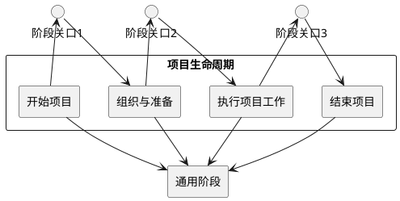

# 1. 项目基本要素

## 1.1 项目

## 1.2 项目管理的重要性

## 1.3 项目、项目集、项目组合及运营

## 1.4 项目关键组成部分
### 1.4.1 项目生命周期

*   项目阶段可基于各种因素而建立，其中包括（但不限于）：
    *   管理需求；
    *   项目性质；
    *   组织、行业或技术的独特性；
    *   项目的组成要素，包括但不限于技术、工程、业务、过程或法律；
    *   **决策点**（例如资金、继续/终止项目、里程碑审查）。
*   分为多个阶段的方式有助于**更好地掌控项目管理**，同时还提供了评估项目绩效并在后续阶段采取必要的纠正或预防措施的机会。

### 1.4.2 项目生命周期特征

*   通用的生命周期结构一般具有以下特征：
    *   在不显著影响成本和进度的前提下，**干系人改变项目产品最终特性的能力在项目开始时最大，并随项目进展而减弱**。
    *   下图表明，做出变更和纠正错误的成本，通常会随着项目越来越接近完成而显著增高。
    *   成本和人力投入在开始时较低，在工作执行期间逐渐增加，并在项目快要结束时迅速回落。
    *   项目开始时风险最大，如下图所示。在项目的整个生命周期中，随着决策的制定与可交付成果的验收，风险会逐步降低。
*   **项目生命周期会受组织、行业、开发方法或所用技术的独特性的影响。**
*   虽然每个项目都有起点和终点，但具体的交付成果和工作会因项目的不同而有很大差异。
*   不论项目涉及的具体工作是什么，生命周期都可以为管理项目提供基本框架所有项目都呈现下图所示的**通用的生命周期**。

### 1.4.3 阶段关口
*   根据比较结果做出决定（例如继续/终止的决定），以便：
    *   进入下一个阶段；
    *   整改后进入下一个阶段；
    *   结束项目；
    *   停留在当前阶段；
    *   重复阶段或某个要素。
*   在不同的组织、行业或工作类型中，**阶段关口**可能被称为阶段审查、阶段门、关键决策点和阶段入口或阶段出口。
*  **阶段关口**在项目阶段结束时进行，**将项目的绩效和进度与项目和业务文件比较**。
*   这些文件包括（但不限于）：
    *   商业论证；
    *   项目章程；
    *   项目管理计划；
    *   效益管理计划。

### 1.4.4 开发生命周期
*   **开发生命周期**可以是预测型、迭代型、增量型、适应型或混合型的模式：
    *   **混合型生命周期**是预测型生命周期和适应型生命周期的组合。充分了解或有确定要求的项目要素遵循预测型开发生命周期，而仍在发展中的要素遵循适应型开发生命周期。
*   由项目管理团队确定各项目最适合的生命周期。项目生命周期需要足够灵活，能够应对项目包含的各种因素。
*   **开发生命周期**可以是预测型、迭代型、增量型、适应型或混合型的模式：
    *   **预测型生命周期**。在生命周期的早期阶段确定项目范围、时间和成本。对任何范围的变更都要进行仔细管理。预测型生命周期也称为瀑布型生命周期。
    *   **迭代型生命周期**。项目范围通常于项目生命周期的早期确定，但时间和成本估算将随着项目团队对产品理解的不断深入而定期修改。迭代方法是通过一系列重复的循环活动来开发产品，而增量方法是渐进地增加产品的功能。
    *   **增量型生命周期**是通过在预定的时间区间内渐进地增加产品功能的一系列迭代来产出可交付成果。只有在最后一次迭代之后，可交付成果具有了必要和足够的能力，才能被视为完整的。
    *  **适应型生命周期**属于敏捷型、迭代型或增量型。详细范围在迭代开始之前就得到了定义和批准。适应型生命周期也称为敏捷或变更驱动型生命周期。各生命周期特征参见下图。
*   **开发生命周期**可以是预测型或适应型。
*  项目生命周期内通常有一个或多个阶段与产品、服务或成果的开发相关，这些阶段称为开发生命周期。

### 1.4.6 项目管理过程组
*   **项目管理过程组**指对项目管理进行逻辑分组，以达成项目的特定目标。
*   过程组不同于项目阶段。
*   项目管理过程可分为以下五个项目管理过程组：
    *   **启动过程组**定义一个新项目或现有项目的一个新阶段，授权开始该项目或阶段的一组过程。
    *   **规划过程组**明确项目范围，优化目标，为实现目标制定行动方案的一组过程。
    *   **执行过程组**完成项目管理计划中确定的工作，以满足项目要求的一组过程。
    *   **监控过程组**跟踪、审查和调整项目进展与绩效，识别必要的计划变更并启动相应变更的一组过程。
    *   **收尾过程组**正式完成或结束项目、阶段或合同所执行的过程。

### 1.4.7 项目管理知识领域
*   项目整合管理包括为识别、定义、组合、统一和协调各项目管理过程组的各个过程和活动而开展的过程与活动。
*   项目范围管理包括确保项目只做所需全部工作以成功完成项目的各个过程。
*   项目进度管理包括为管理项目按时完成所需的各个过程。
*   项目成本管理包括为使项目在批准的预算内完成而对成本进行规划、估算、预算、融资、筹资、管理和控制的各个过程。
*   项目质量管理包括把组织的质量政策应用于规划、管理、控制项目和产品质量要求，以满足干系人的期望的各个过程。
*   项目资源管理包括识别、获取和管理所需资源以成功完成项目的各个过程。
*   项目沟通管理包括为确保项目信息及时且恰当地规划、收集、生成、发布、存储、检索、管理、控制、监督和最终处置的各个过程。
*   项目风险管理包括规划风险管理、识别风险、开展风险分析、规划风险应对、实施风险应对和监督风险的各个过程。
*   项目采购管理包括从项目团队外部采购或获取所需产品、服务或成果的各个过程。
*   项目干系人管理包括用于开展下列工作的各个过程：识别影响或受项目影响的人员、团队或组织，分析干系人对项目的期望和影响，制定合适的管理策略来有效调动干系人参与项目决策和执行。

### 1.4.8 项目管理数据和信息
*   在整个项目生命周期中需要定期收集和分析项目数据。关于项目数据和信息的主要术语语义定义如下：
    *   **工作绩效数据**。在执行项目工作的过程中，从每个正在执行的活动中收集到的原始观察结果和测量值。例如包括工作完成百分比、质量和技术绩效测量结果、进度计划活动的开始和结束日期、变更请求的数量、缺陷的数量、实际成本和实际持续时间等。项目数据通常记录在项目管理信息系统(PMIS)和项目文件中。
    *   **工作绩效信息**。从各控制过程收集，并结合相关背景和跨领域关系进行整合分析而得到的绩效情况。绩效信息的例子包括可交付成果的状态、变更请求的落实情况及预测的完工尚需估算。
    *  **工作绩效报告**。为制定决策、提出问题、采取行动或引起关注，而汇编工作绩效信息所形成的实物或电子项目文件。例如包括状况报告、备忘录、论证报告、信息札记、电子仪表盘、推荐意见和情况更新。

## 1.5 裁剪

## 1.6 项目商业文件

### 1.6.1 项目商业论证

*   项目商业论证指文档化的经济可行性研究报告，用来对尚缺乏充分定义的所选方案的收益进行有效性论证，是启动后续项目管理活动的依据。
    *   商业论证列出了项目启动的目标和理由。
    *   它有助于在项目结束时根据项目目标衡量项目是否成功。
    *   商业论证是一种项目商业文件，可在整个项目生命周期中使用。
*   商业论证可能包括（但不限于）记录以下内容：
    *   **推荐：**
        *   一种给出了针对项目的建议方案的说明书；
        *   一种实施方法。
    *   **评估：**
        *   一种描述了衡量项目交付效益的计划的说明书，应包含在初步实施之后，任何持续运营层面的可选方案。
    *   **形势分析：**
        *   确定组织战略、目的和目标；
        *   确定问题的根本原因或机会的触发因素；
        *   分析项目所需能力与组织现有能力之间的差距；
        *   识别已知风险；
        *   识别成功的关键因素；
        *   确定可能用于评估各种行动的决策准则；
        *   **确定一套方案，用以处理业务问题或机会。可选方案指组织可能采取的备选行动方案。**
        *   可选方案也可称为商业场景。
    *   **业务需要：**
        *   确定促进采取行动的动机；
        *   情况说明，记录了待处理的业务问题或机会，包括能够为组织创造的价值；
        *   确定受影响的干系人；
        *   确定范围。
    *   **需求评估**通常是在商业论证之前进行，包括了解业务目的和目标、问题及机会，并提出处理建议。
    *   需求评估结果可能会在商业论证文件中进行总结。
*   在项目启动之前通过商业论证，可能会做出继续/终止项目的决策。

### 1.6.2 项目效益管理计划

*   项目效益管理计划的制定和维护是一项迭代活动。
*   它是商业论证、项目章程和项目管理计划的补充性文件。
*   项目经理与发起人共同确保项目章程、项目管理计划和效益管理计划在整个项目生命周期内始终保持一致。
*   制定效益管理计划需要使用商业论证和需求评估中的数据和信息，例如，成本效益分析数据。
    *   在成本效益分析中已经把成本估算与项目拟实现的效益进行了比较。
    *   效益管理计划和项目管理计划描述了项目创造的商业价值如何能够成为组织持续运营的一部分，包括使用的测量指标。
    *   测量指标可核实商业价值并确认项目成功与否。
*   它描述了效益的关键要素，可能包括（但不限于）记录以下内容：
    *   **目标效益**（例如预计通过项目实施可以创造的有形价值和无形价值，财务价值体现为净现值）；
    *   **战略一致性**（例如项目效益与组织业务战略的一致程度）；
    *   **实现效益的时限**（例如阶段效益、短期效益、长期效益和持续效益）；
    *   **效益责任人**（例如在计划确定的整个时限内负责监督、记录和报告已实现效益的负责人）；
    *   **测量指标**（例如用于显示已实现效益的直接测量值和间接测量值）；
    *   **假设**（例如预计存在或显而易见的因素）；
    *   **风险**（例如实现效益的风险）。
*   项目效益管理计划描述了项目实现效益的方式和时间，以及应制定的效益衡量机制。
*   项目效益指为发起组织和项目预期受益方创造价值的行动、行为、产品、服务或成果的结果。
*   项目生命周期早期应确定目标效益，并据此制定效益管理计划。

### 1.6.3 项目章程和项目管理计划

*   **项目章程**是由项目发起人发布的，正式批准项目成立，并授权项目经理动用组织资源开展项目活动的文件。
*   **项目管理计划**是描述如何执行、监督和控制项目的一份文件。

### 1.6.4 项目成功标准

*   项目成功可能涉及与组织战略和业务成果交付有关的其他标准。这些项目目标可能包括（但不限于）：
    *   达到组织战略、目的和目标；
    *   使干系人满意；
    *   可接受的客户/最终用户的采纳度；
    *   将可交付成果整合到组织的运营环境中；
    *   满足商定的交付质量；
    *   遵循治理规则；
    *   满足商定的其他成功标准或准则（例如过程产出率）。
*   项目成功可能涉及与组织战略和业务成果交付有关的其他标准。这些项目目标可能包括（但不限于）：
    *   完成项目效益管理计划；
    *   达到商业论证中记录的已商定的财务测量指标。这些财务测量指标可能包括（但不限于）：
        *   净现值（NPV）; **>** **0**
        *   投资回报率（ROI）; **>** **0**
        *   内部报酬率（IRR）; **>** **0**
        *   回收期（PBP）;
        *   效益成本比率（BCR）。 **>** **1**
    *   达到商业论证的非财务目标；
    *   完成组织从“当前状态”转到“将来状态”；
*   确定项目是否成功是项目管理中最常见的挑战之一。
*   时间、成本、范围和质量等项目管理测量指标历来被视为确定项目是否成功的最重要的因素。最近，从业者和学者提出，确定项目是否成功还应考虑项目目标的实现情况。
*   关于项目成功的定义和最重要的因素，项目干系人可能有不同的看法。明确记录项目目标并选择可测量的目标是项目成功的关键。
*   主要干系人和项目经理应思考以下三个问题：
    *   怎样才是项目成功？
    *   如何评估项目成功？
    *   哪些因素会影响项目成功？
*   主要干系人和项目经理应就这些问题达成共识并予以记录。

### 1.6.5 项目管理商业文件

*   项目发起人通常负责项目商业论证文件的制定和维护。项目经理负责提供建议和见解，使项目商业论证、项目管理计划、项目章程和项目效益管理计划中的成功标准相一致，并与组织的目的和目标保持一致。
*   项目经理应适当地为项目裁剪上述项目管理文件。某些组织会维护项目集层面的商业论证和效益管理计划。项目经理应与相应的项目集经理合作，确保项目管理文件与项目集文件保持一致。下图说明了这些关键项目管理商业文件与需求评估之间的相互关系，展示了项目生命周期内各种文件的大概生命周期。
*   项目经理需要确保项目管理方法紧扣商业文件的意图。下图列出了这些文件的定义。在整个项目生命周期中，这两种文件相互依赖并反复制定和维护。

| 项目商业文件 | 定义 |
|---|---|
| 项目商业论证 | 文档化的经济可行性研究报告，用来对尚缺乏充分定义的所选方案的收益进行有效性论证，是启动后续项目管理活动的依据。 |
| 项目效益管理计划 | 对创造、提高和保持项目效益的过程进行定义的书面文件。 |

### 1.6.6 项目管理过程组

*   项目管理过程组指对项目管理进行逻辑分组，以达成项目的特定目标。
*   过程组不同于项目阶段。
*   项目管理过程可分为以下五个项目管理过程组：
    *   **启动过程组** 定义一个新项目或现有项目的一个新阶段，授权开始该项目或阶段的一组过程。
    *   **规划过程组** 明确项目范围，优化目标，为实现目标制定行动方案的一组过程。
    *   **执行过程组** 完成项目管理计划中确定的工作，以满足项目要求的一组过程。
    *   **监控过程组** 跟踪、审查和调整项目进展与绩效，识别必要的计划变更并启动相应变更的一组过程。
    *   **收尾过程组** 正式完成或结束项目、阶段或合同所执行的过程。

### 1.6.7 项目管理知识领域

*   项目整合管理包括为识别、定义、组合、统一和协调各项目管理过程组的各个过程和活动而开展的过程与活动。
*   项目范围管理包括确保项目只做所需的所有工作以成功完成项目的各个过程。
*   项目进度管理包括为管理项目按时完成所需的各个过程。
*   项目成本管理包括为使项目在批准的预算内完成而对成本进行规划、估算、预算、融资、筹资、管理和控制的各个过程。
*   项目质量管理包括把组织的质量政策应用于规划、管理、控制项目和产品质量要求，以满足干系人的期望的各个过程。
*   项目资源管理包括识别、获取和管理所需资源以成功完成项目的各个过程。
*   项目沟通管理包括为确保项目信息及时且恰当地规划、收集、生成、发布、存储、检索、管理、控制、监督和最终处置所需的各个过程。
*   项目风险管理包括规划风险管理、识别风险、开展风险分析、规划风险应对、实施风险应对和监督风险的各个过程。
*   项目采购管理包括从项目团队外部采购或获取所需产品、服务或成果的各个过程。
*   项目干系人管理包括用于开展下列工作的各个过程：识别影响或受项目影响的人员、团队或组织，分析干系人对项目的期望和影响，制定合适的管理策略来有效调动干系人参与项目决策和执行。

### 1.6.8 项目管理数据和信息

*   在整个项目生命周期中需要定期收集和分析项目数据。关于项目数据和信息的主要术语定义如下：
    *   **工作绩效数据。** 在执行项目工作的过程中，从每个正在执行的活动中收集到的原始观察结果和测量值。例如包括工作完成百分比、质量和技术绩效测量结果、进度计划活动的开始和结束日期、变更请求的数量、缺陷的数量、实际成本和实际持续时间等。项目数据通常记录在项目管理信息系统（PMIS）和项目文件中。
    *   **工作绩效信息。** 从各控制过程收集，并结合相关背景和跨领域关系进行整合分析而得到的绩效情况。绩效信息的例子包括可交付成果的状态、变更请求的落实情况及预测的完工尚需估算。
    *   **工作绩效报告。** 为制定决策、提出问题、采取行动或引起关注，而汇编工作绩效信息所形成的实物或电子项目文件。例如包括状况报告、备忘录、论证报告、信息札记、电子仪表盘、推荐意见和情况更新。

