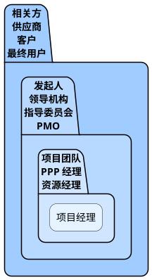
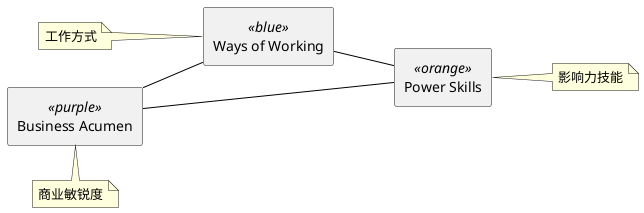
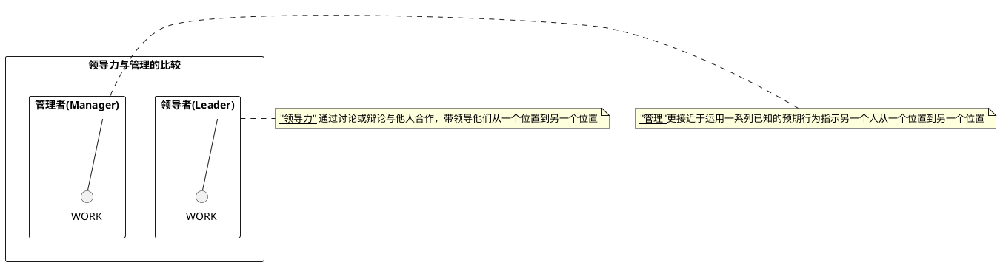

# 项目管理基础知识

## 1、项目基本要素
## 2、项目运行环境
## 3、项目经理的角色

### 3.1 项目经理角色示例
### 3.2 项目经理的定义
*   项目经理的角色不同于职能经理或运营经理。
*   一般而言，职能经理专注于对某个职能领域或业务部门的管理监督。
*   运营经理负责保证业务运营的高效性。
*   项目经理是由执行组织委派，领导团队实现项目目标的个人。

### 3.3 项目干系人

*   相关方是指可能影响项目决策、活动或结果的个人、群体或组织，以及会受或自认为会受项目决策、活动或结果影响的个人、群体或组织。
*   项目相关方可能来自项目内部或外部，可能主动或被动参与项目，甚至完全不了解项目。
*   项目相关方可能对项目施加积极或消极影响，也可能受项目的积极或消极影响。

### 3.4 项目经理的影响力范围
*   项目经理在其影响力范围内担任多种角色。
*   这些角色反映了项目经理的能力，体现了项目经理这一职业的价值和作用。

#### 3.4.1 项目
*   项目经理领导项目团队实现项目目标和干系人的期望。
*   项目经理利用可用资源，以平衡相互竞争的制约因素。
*   项目经理还充当项目发起人、团队成员与其他干系人之间的沟通者，包括提供指导和展示项目成功的愿景。
*   项目经理使用软技能 (例如人际关系技能和人员管理技能) 来平衡项目干系人之间相互冲突和竞争的目标，以达成共识。这种情况下的共识指即便不 100% 赞同，干系人还会支持项目决定和行动。

### 3.5 项目经理的能力
*   近期PMI研究通过PMI人才三角（见下图）指出了项目经理根据《项目经理能力发展(PMCD)框架》需要具备的技能。人才三角重点关注三个关键技能组合：
    * 工作方式
    * 影响力技能
    * 商业敏锐度

### 3.6 领导力
*   领导力技能包括指导、激励和带领团队的能力。
*   这些技能可能包括协商、抗压、沟通、解决问题、批判性思考和人际关系技能等基本能力。
*   随着越来越多的公司通过项目执行战略，项目变得越来越复杂。
*   项目管理不仅仅涉及数字、模板、图表、图形和计算机系统方面的工作。
*   人是所有项目中的共同点。
*   人可以计数，但不仅仅是数字。

### 3.6.3 权术、权力，和办好事情

*   领导和管理的最终目的是办好事情。这些技能和品质有助于项目经理实现项目的目的和目标。很多技能和品质归根究底就是处理政治的能力。政治涉及影响、谈判、自主和权力。
*   政治及其相关要素不局限于“好”与“不好”以及“正面”与“负面”之分。项目经理对组织运行方式的了解越多，就越有可能获得成功。项目经理应观察并收集有关项目和组织概况的数据，然后从项目、相关人员、组织以及整个环境出发来审查这些数据，从而得出计划和执行大多数行动所需的信息和知识。这些行动是项目经理运用适当的权力影响他人和进行协商之后的结果。

*   行使权力的方式包括 (但不限于)：
   * 地位 (有时称为正式的、权威的、合法的，例如组织或团队授予的正式职位)；
   * 信息 (例如收集或分发的控制)；
   * 参考 (例如因为他人的尊重和赞赏，获得的信任)；
   * 情境 (例如在危机等特殊情况下获得的权力)；
   * 个性或魅力 (例如魅力、吸引力)；
   * 关系 (例如参与人际交往、联系和结盟)；
   * 专家 (例如拥有的技能和信息、经验、培训、教育、证书)；
   * 奖励相关的 (例如能够给予表扬、金钱或其他奖励)；
   * 处罚或强制力 (例如给予纪律处分或施加负面后果的能力)；
   
*   行使权力的方式包括 (但不限于)：
   * 迎合(例如运用顺从或其他常用手段赢得青睐或合作)；
   * 施加压力 (例如限制选择或活动自由，以符合预期的行动)；
   * 出于愧疚 (例如加强的义务或责任感)；
   * 说服力 (例如能够提供论据，使他人执行预期的行动方案)；
   * 回避 (例如拒绝参与)。

* **在权力方面，顶尖的项目经理积极主动且目的明确。这些项目经理会在组织政策、协议和程序许可的范围内主动寻求所需的权力和职权，而不是坐等组织授权。**

### 3.6.4 领导力与管理的比较
*   研究显示项目经理可以采用的多种领导力风格。在这些风格中，最常见的包括（但不限于）：
    * **放任型领导**（例如，允许团队自主决策和设定目标，又被称为“无为而治”）；
    * **交易型领导**（例如，关注目标、反馈和成就以确定奖励，例外管理）；
    * **服务型领导**（例如，做出服务承诺，处处先为他人着想；关注他人的成长、学习、发展、自主性和福祉；关注人际关系、团体与合作；服务优先于领导）；
    * **变革型领导**（例如，通过理想化特质和行为、鼓舞性激励、促进创新和创造，以及个人关怀，提高追随者的能力）；
    * **魅力型领导**（例如，能够激励他人；精神饱满、热情洋溢、充满自信；说服力强）；
    * **交互型领导**（例如，结合了交易型、变革型和魅力型领导的特点）。

*   “领导力”和“管理”这两个词经常被互换使用，但它们并不是同义词。
    *   “管理”更接近于运用一系列已知的预期行为指示另一个人从一个位置到另一个位置。
    *   相反，“领导力”指通过讨论或辩论与他人合作，带领导他们从一个位置到另一个位置。
*   为了获得成功，项目经理必须同时采用领导力和管理这两种方式。
*   技巧在于如何针对各种情况找到恰当的平衡点。项目经理的领导风格通常体现了他们所采用的管理和领导力方式。

### 3.7 执行整合
