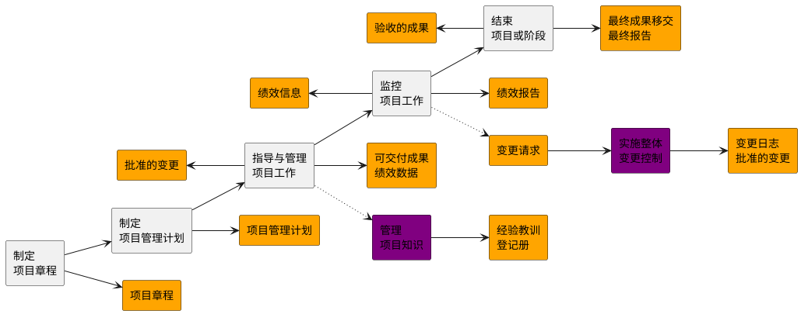

## 1. 基于过程的项目管理方法

### 1.1. 概述

*   第01章 项目整合管理
*   第02章 项目范围管理
*   第03章 项目进度管理
*   第04章 项目成本管理
*   第05章 项目质量管理
*   第06章 项目资源管理
*   第07章 项目沟通管理
*   第08章 项目风险管理
*   第09章 项目采购管理
*   第10章 项目相关方管理
*   第11章 工具与技术

### 1.2. 知识领域与项目管理过程组

| 知识领域       | 启动过程组   | 规划过程组       | 执行过程组       | 监控过程组       | 收尾过程组   |
| -------------- | ------------ | ---------------- | ---------------- | ---------------- | ------------ |
| 项目整合管理   | 制定项目章程 | 制定项目管理计划 | 指导与管理项目工作，管理项目知识 | 监控项目工作，实施整体变更控制 | 结束项目或阶段 |
| 项目范围管理   |              | 规划范围管理，收集需求，定义范围，创建WBS |                  | 确认范围，控制范围 |            |
| 项目进度管理   |              | 规划进度管理，定义活动，排列活动顺序，估算活动持续时间，制定进度计划 |                  | 控制进度       |            |
| 项目成本管理   |              | 规划成本管理，估算成本，制定预算 |                  | 控制成本       |            |
| 项目质量管理   |              | 规划质量管理     | 管理质量         | 控制质量       |            |
| 项目资源管理   |              | 规划资源管理，估算活动资源 | 获取资源，建设团队，管理团队 | 控制资源       |            |
| 项目沟通管理   |              | 规划沟通管理     | 管理沟通         | 监督沟通       |            |
| 项目风险管理   |              | 规划风险管理，识别风险，实施定性风险分析，实施定量风险分析，规划风险应对 | 实施风险应对     | 监督风险       |            |
| 项目采购管理   |              | 规划采购管理     | 实施采购         | 控制采购       |            |
| 项目相关方管理 | 识别相关方   | 规划相关方参与   | 管理相关方参与   | 监督相关方参与   |            |

## 2. 项目整合管理 - 概述
*   项目整合管理包括对隶属于项目管理过程组的各种过程和项目管理活动进行识别、定义、组合、统一和协调的各个过程。在项目管理中，整合兼具统一、合并、沟通和建立联系的性质，这些行动应该贯穿项目始终。
*   项目整合管理包括以下选择：
    *   资源分配；
    *   平衡竞争性需求；
    *   研究各种备选方法；
    *   为实现项目目标而裁剪过程；
    *   管理各个项目管理知识领域之间的依赖关系。

*   项目整合管理过程包括：
    *   1.1 **制定项目章程** — 编写一份正式批准项目并授权项目经理在项目活动中使用组织资源的文件过程。
    *   1.2 **制定项目管理计划** — 定义、准备和协调项目计划的所有组成部分，并把它们整合为一份综合项目管理计划的过程。
    *   1.3 **指导与管理项目工作** — 为实现项目目标而领导和执行项目管理计划中所确定的工作，并实施已批准变更的过程。
    *   1.4 **管理项目知识** — 使用现有知识并生成新知识，以实现项目目标，并且帮助组织学习的过程。
    *   1.5 **监控项目工作** — 跟踪、审查和报告整体项目进展，以实现项目管理计划中确定的绩效目标的过程。
    *   1.6 **实施整体变更控制** — 审查所有变更请求，批准变更，管理对可交付成果、组织过程资产、项目文件和项目管理计划的变更，并对变更处理结果进行沟通的过程。
    *   1.7 **结束项目或阶段** — 终结项目、阶段或合同的所有活动的过程。

## 3. 项目整合管理 - 核心概念
*   项目整合管理由项目经理负责。
    *   虽然其他知识领域可以由相关专家（如成本分析专家、进度规划专家、风险管理专家）管理，但是**项目整合管理的责任不能被授权或转移**。
    *   **只能由项目经理负责整合所有其他知识领域的成果，并掌握项目总体情况**。
    *   项目经理**必须**对整个项目承担**最终**责任。

*   项目与项目管理本质上具有整合性质，例如，为应急计划制定成本估算时，就需要整合项目成本管理、项目进度管理和项目风险管理领域中的相关过程。**在识别出与各种人员配备方案有关的额外风险时，可能需要再次进行上述某个或某几个过程**。
*   **项目管理过程组的各个过程之间经常反复发生联系**。例如，在项目早期，规划过程组为执行过程组提供书面的项目管理计划；然后，随着项目的进展，规划过程组还将根据变更情况，更新项目管理计划。

*   项目整合管理指的是：
    *   确保产品、服务或成果的交付日期，项目生命周期以及效益管理计划这些方面保持一致；
    *   编制项目管理计划以实现项目目标；
    *   确保创造合适的知识并运用到项目中，并从项目中获取必要的知识；
    *   管理项目计划中活动的绩效和变更；
    *   做出针对影响项目的关键变更的综合决策；
    *   测量和监督项目进展，并采取适当措施以实现项目目标；
    *   收集关于已达成成果的数据，分析数据以获取信息，并与相关方分享信息；
    *   完成全部项目工作，正式关闭各个阶段、合同以及整个项目；
    *   管理可能需要的阶段过渡。
*   项目越复杂，相关方的期望越多样化，就需要越全面的整合方法。

## 4. 项目整合管理

### 4.1. 1.1 制定项目章程

*   项目章程在项目执行组织与需求组织之间建立起伙伴关系。在执行外部项目时,通常需要用正式
的合同来达成合作协议。这种情况下,可能仍要用项目章程来建立组织内部的合作关系,以确保
正确交付合同内容。
*   **项目章程一旦被批准,就标志着项目的正式启动。**
*   在项目中,应尽早确认并任命项目经理,最好在制定项目章程时就任命,且总应在规划开始之前
任命。
*   项目章程可由发起人编制,或者由项目经理与发起机构合作编制。通过这种合作,项目经理可以
更好地了解项目目的、目标和预期效益,以便更有效地向项目活动分配资源。
*   项目章程授权项目经理规划、执行和控制项目。

* 项目由项目以外的机构来启动，如发起人、项目集或项目管理办公室 (PMO)、项目组合治理委
员会主席或其授权代表。
* **项目启动者或发起人应该具有一定的职权，能为项目获取资金并提供资源。**
* 项目可能因内部经营需要或外部影响而启动，故通常需要编制需求分析、可行性研究、商业论证
或有待项目处理的情况的描述。
* 通过编制项目章程，来确认项目符合组织战略和日常运营的需要。
* **不要把项目章程看作合同，因为其中未承诺报酬或金钱或用于交换的对价**。

#### 4.1.1. 1.1.1 商业文件

*   在商业论证和效益管理计划中，可以找到项目目标以及项目对业务目标的贡献的相关信息。
*   **虽然商业文件是在项目之前制定的，但需要定期审核。**
*   **商业论证**：经批准的商业论证或类似文件是最常用于制定项目章程的商业文件。
    *   商业论证从商业视角描述必要的信息，并且据此决定项目的期望结果是否值得所需投资。
    *   高于项目级别的经理和高管们通常使用该文件作为决策的依据。
    *   一般情况下，商业论证会包含商业需求和成本效益分析，以论证项目的合理性并确定项目边界。
*   项目章程包含来源于商业文件中的相关项目信息。
*   **既然商业文件不是项目文件，项目经理就不可以对它们进行更新或修改，只可以提出相关建议。**

#### 4.1.2. 1.1.2 协议

*   协议用于定义项目初衷。
*   协议有多种形式，包括合同、谅解备忘录（MOUs）、服务水平协议（SLA）、协议书、意向书、口头协议、电子邮件或其他书面协议。
*   为外部客户做项目时，通常就以合同的形式出现。

#### 4.1.3. 1.1.2.1 项目章程

*   **项目章程是由项目启动者或发起人发布的，正式批准项目成立，并授权项目经理使用组织资源开展项目活动的文件。** 它记录了关于项目和项目预期交付的产品、服务或成果的高层级信息，例如：**2229**
    *   项目**目的**；
    *   可测量的项目**目标**和相关的**成功标准**；
    *   高层级需求；
    *   高层级项目描述、边界定义以及主要可交付成果；
    *   整体项目风险；
    *   总体里程碑进度计划；
    *   预先批准的财务资源；
    *   关键相关方名单；
    *   项目审批要求（例如，用什么标准评价项目成功，由谁对项目成功下结论，由谁来签署项目结束）；
    *   项目**退出标准**（例如，在何种条件下才能关闭或取消项目或阶段）；
    *   委派的**项目经理**及其职责和职权；
    *   **发起人**或其他批准项目章程的人员的姓名和职权。
*   项目章程确保相关方在总体上就主要可交付成果、里程碑以及每个项目参与者的角色和职责达成共识。

#### 4.1.4. 1.1.2.2 假设日志

*   通常，在项目启动之前编制商业论证时，识别高层级的战略和运营假设条件与制约因素。
*   这些假设条件与制约因素应纳入项目章程。
*   较低层级的活动和任务假设条件在项目期间随着诸如定义技术规范、估算、进度和风险等活动的开展而生成。
*   **假设日志用于记录整个项目生命周期中的所有假设条件和制约因素。**

### 4.2. 1.2 制定项目管理计划

*   制定项目管理计划是定义、准备和协调项目计划的所有组成部分，并把它们整合为一份综合项目管理计划的过程。本过程的主要作用是，生成一份综合文件，用于确定所有项目工作的基础及其执行方式。
*   项目管理计划确定项目的执行、监控和收尾方式，其内容会因项目所在的的应用领域和复杂程度而异。
*   项目管理计划可以是概括或详细的，而每个组成部分的详细程度取决于具体项目的要求。
*   项目管理计划应足够强大，可以应对不断变化的项目环境。
*   这种敏捷性有利于随项目进展产出更准确的信息。
*   **项目管理计划应基准化，即至少应规定项目的范围、时间和成本方面的基准，以便据此考核项目执行情况和管理项目绩效。**
*   在确定基准之前，可能要对项目管理计划进行多次更新，且这些更新需遵循正式流程。
*   但是，一旦确定了基准，就只能通过实施整体变更控制过程进行更新。
*   在这种情况下，如果需要进行变更，应提出变更请求以待决定。
*   这一过程将形成一份项目管理计划。在项目收尾之前，该计划需要通过不断更新来渐进明细，且这些更新需要得到控制和批准。
*   对隶属于项目集或项目组合的项目，则应该制定与项目集或项目组合管理计划相一致的项目管理计划。
*   例如，项目集管理计划中要求超过某一特定成本的所有变更都需要上报变更控制委员会（CCB）审查，在项目管理计划中就应该对审查流程和成本临界值做出相应规定。

#### 4.2.1. 1.2.1.1 项目章程

*   项目团队把项目章程作为初始项目规划的起始点。
*   项目章程所包含的信息种类数量因项目的复杂程度和已知的信息而异。
*   在项目章程中至少应该定义项目的高层级信息,供将来在项目管理计划的各个组成部分中进一步细化。

#### 4.2.2. 1.2.1.2 其他过程的输出

*   创建项目管理计划需要整合诸多过程的输出。
*   其他规划过程所输出的子计划和基准都是本过程的输入。
*   此外,对这些子计划和基准的变更都可能导致对项目管理计划的相应更新。

#### 4.2.3. 1.2.2.1 项目管理计划

*   项目管理计划是说明项目执行、监控和收尾方式的一份文件，它整合并综合了所有子项目计划和基准，以及管理项目所需的其他信息。
*   究竟需要哪些项目管理计划组件，取决于具体项目的需求。
*   项目管理计划组件包括（但不限于）：**9331**
*   子管理计划：
    *   范围管理计划： 确立如何定义、制定、监督、控制和确认项目范围。
    *   **需求管理计划：** 确定如何分析、记录和管理需求。
    *   进度管理计划： 为编制、监督和控制项目进度建立准则并确定活动。
    *   成本管理计划：确定如何规划、安排和控制成本。
    *   质量管理计划：确定在项目中如何实施组织的质量政策、方法和标准。
    *   资源管理计划：指导如何对项目资源进行分类、分配、管理和释放。
    *   沟通管理计划：确定项目信息将如何、何时、由谁来进行管理和传播。
    *   风险管理计划：确定如何安排与实施风险管理活动。
    *   采购管理计划：确定项目团队将如何从执行组织外部获取货物和服务。
    *   相关方参与计划：确定如何根据相关方的需求、利益和影响让他们参与项目决策和执行。
*   其他组件：大多数项目管理计划组件都来自于其他过程，虽然有些组件是在本过程生成的。虽然在本过程生成的组件会因项目而异，但是通常包括（但不限于）：
    *   **变更管理计划：** 描述在整个项目期间如何正式审批和采纳变更请求。
    *   **配置管理计划：** 描述如何记录和更新项目的特定信息，以及该记录和更新哪些信息，以保持产品、服务或成果的一致性（和）有效性。
    *   项目生命周期：描述项目从开始到结束所经历的一系列阶段。
    *   开发方法：描述产品、服务或成果的开发方法，例如预测、迭代、敏捷或混合型模式。
    *   管理审查：确定项目经理和相关方审查项目进展的时间点，以考核绩效是否符合预期，或者确定是否有必要采取预防或纠正措施。
*   **基准：**
    *   **范围基准：** 经过批准的范围说明书、工作分解结构（WBS）和相应的WBS词典，用作比较依据。
    *   **进度基准：** 经过批准的进度模型，用作与实际结果进行比较的依据。
    *   **成本基准：** 经过批准的、按时间段分配的项目预算，用作与实际结果进行比较的依据。
    *   **绩效测量基准：** 经过整合的项目范围、进度和成本计划，用作项目执行的比较依据，以测量和管理项目绩效。

### 4.3. 1.3 指导与管理项目工作

*   项目经理与项目团队一起实施已计划好的项目活动，并管理项目内的各种技术接口和组织接口。
*   指导与管理项目工作还要求回顾所有项目变更的影响，并**实施已批准的变更**，包括纠正措施、预防措施和（或）缺陷补救。
*   在项目执行过程中，收集**工作绩效数据**并传送给**合适的控制过程**做进一步分析。通过分析工作绩效数据，得到关于可交付成果的完成情况以及与项目绩效相关的其他细节，工作绩效数据也用作监控过程的输入，并可作为反馈输入到经验教训训练，以改善未来工作的绩效。
*   指导与管理项目工作包括执行计划的项目活动，以完成项目可交付成果并达成既定目标。
*   本过程需要分配可用资源并管理其有效使用，也需要执行因分析工作绩效数据和信息而提出的项目计划变更。
*   指导与管理项目工作过程会受所在应用领域的直接影响，按项目管理计划中的规定，开展相关过程，完成项目工作，并产出可交付成果。
*   指导与管理项目工作是为实现项目目标而领导和执行项目计划中**所确定的工作**，并实施已批准变更的过程。本过程的主要作用是，对项目工作和可交付成果开展综合管理，以提高项目成功的可能性。

    *   **输入**
        *   .1 项目管理计划
        *   .2 任何组件
        *   .3 项目文件
            *   变更日志
            *   经验教训登记册
            *   里程碑清单
            *   项目沟通记录
            *   项目进度计划
            *   需求跟踪矩阵
            *   风险登记册
            *   风险报告
            *   批准的变更请求
        *   .4 事业环境因素
        *   .5 组织过程资产
    *   **工具与技术**
        *   .1 专家判断
        *   .2 项目管理信息系统
        *   .3 会议
    *   **输出**
        *   .1 可交付成果
        *   .2 工作绩效数据
        *   .3 问题日志
        *   .4 变更请求
        *   .5 项目管理计划更新
            *   任何组件
        *   .6 项目文件更新
            *   活动清单
            *   假设日志
            *   经验教训登记册
            *   需求文件
            *   风险登记册
            *   相关方登记册
        *   .7 组织过程资产更新

#### 4.3.1. 1.3.1.3 批准的变更请求

*   **批准的变更请求**是实施整体变更控制过程的**输出**，包括经项目经理审查和批准的变更请求，必要时可经变更控制委员会（CCB）审查和批准。
*   批准的变更请求可能是纠正措施、预防措施或缺陷补救，并由项目团队纳入项目进度计划付诸实施，可能对项目或项目管理计划的任一领域产生影响，还可能导致修改正式受控的项目管理计划组件或项目文件。

#### 4.3.2. 1.3.2.1 可交付成果

*   **可交付成果**是在某一过程、阶段或项目完成时，必须产出的任何独特并可核实的产品、成果或服务能力。
*   它通常是项目结果，并可包括项目管理计划的组成部分。
*   **一旦完成了可交付成果的第一个版本，就应该执行变更控制。**
*   用配置管理工具和程序来支持对可交付成果（如文件、软件和构件）的多个版本的控制。

#### 4.3.3. 1.3.2.2 工作绩效数据

*   **工作绩效数据**是在执行项目工作的过程中，从每个正在执行的活动中收集到的原始观察结果和测量值。
*   数据通常是最低层次的细节，将交由**其他过程**从中提炼出信息。在工作执行过程中收集数据，再交由控制过程做进一步分析。
*   例如，工作绩效数据包括已完成的工作、关键绩效指标（KPI）、技术绩效测量结果、进度活动的实际开始日期和完成日期、已完成的故事点、可交付成果状态、进度进展情况、变更请求的数量、缺陷的数量、实际发生的成本、实际持续时间等。

#### 4.3.4. 1.3.2.3 问题日志

*   在整个项目生命周期中，项目经理通常会遇到问题、差距、不一致或意外冲突。项目经理需要采取某些行动加以处理，以免影响项目绩效。
*   问题日志是一种记录和跟进所有问题的项目文件，所需记录和跟进的内容可能包括：
    *   问题类型；
    *   问题提出者和提出时间；
    *   问题描述；
    *   问题优先级；
    *   由谁负责解决问题；
    *   目标解决日期；
    *   问题状态；
    *   最终解决情况。
*   问题日志可以帮助项目经理有效跟进和管理问题，确保它们得到调查和解决。
*   作为本过程的输出，问题日志被首次创建，尽管在项目期间任何时候都可能发生问题。在整个项目生命周期内应该随同监控活动更新问题日志。

#### 4.3.5. 1.3.2.4 变更请求

*   任何项目相关方都可以提出变更请求，应该通过实施整体变更控制过程对变更请求进行审查和处理。变更请求来源自项目内部或外部，是可选或由法律（合同）强制的。
*   变更请求可能包括：
    *   **纠正措施**。为使项目工作绩效重新与项目管理计划一致，而进行的有目的的活动。
    *   **预防措施**。为确保项目工作的未来绩效符合项目管理计划，而进行的有目的的活动。
    *   **缺陷补救**。为了修正不一致产品或产品组件的有目的的活动。
    *   **更新**。对正式受控的项目文件或计划等进行的变更，以反映修改或增加的意见或内容。
*   变更请求是关于修改任何文件、可交付成果或基准的正式提议。
*   如果在开展项目工作时发现问题，就可提出变更请求，对项目政策或程序、项目或产品范围、项目成本或预算、项目进度计划、项目或产品结果的质量进行修改。其他变更请求包括必要的预防措施或纠正措施，用来防止以后的不利后果。

### 4.4. 1.4 管理项目知识

*   从组织的角度来看，知识管理指的是确保项目团队和其他相关方的技能、经验和专业知识在项目开始之前、开展期间和结束之后得到运用。
*   因为知识存在于人们的思想中，**无法强迫人们分享自己的知识或关注他人的知识**，所以，知识管理最重要的环节就是营造一种**相互信任的氛围**，鼓励人们分享知识或关注他人的知识。如果不鼓励人们分享知识或关注他人的知识，即便最好的知识管理工具和技术也无法发挥作用。
*   在实践中，联合使用知识管理工具和技术（用于人际互动）以及信息管理工具和技术（用于编撰显性知识）来分享知识。
*   一个常见误解是，知识管理只是将知识记录下来用于分享；另一种常见误解是，知识管理只是在项目结束时，总结经验教训，以供未来项目使用。这样的话，只有经编撰的显性知识可以得到分享。
*   因为显性知识缺乏情境，可作不同解读，所以，虽易分享，但无法确保正确理解或应用。隐性知识蕴含情境，却很难编撰。它存在于专家个人的思想中，或者存在于社会团体和情境中，通常经由人际交流和互动来分享。
*   知识通常分为“**显性知识**”（易使用文字、图片和数字进行编撰的知识）和“**隐性知识**”（个体知识以及难以明确表达的知识，如信念、洞察力、经验和“诀窍”）两种。
*   **知识管理**指管理显性和隐性知识，旨在**重复使用现有知识并生成新知识**。
*   有助于达成这两个目的的关键活动是知识分享和知识集成（不同领域知识、情境知识和项目管理知识）。
*   管理项目知识是使用现有知识并生成新知识，以实现项目目标，并且帮助组织学习的过程。本过程的主要作用是，利用已有的组织知识来创造或改进项目成果，并且使当前项目创造的知识可用于支持组织运营和未来的项目或阶段。

    *   **输入**
        *   .1 项目管理计划
        *   .2 所有组件
        *   .3 项目文件
            *   经验教训登记册
            *   项目团队派工单
            *   资源分解结构
            *   供方选择标准
            *   相关方登记册
        *   .4 可交付成果
        *   .5 事业环境因素
        *   .6 组织过程资产
    *   **工具与技术**
        *   .1 专家判断
        *   .2 知识管理
        *   .3 信息管理
        *   .4 人际关系与团队技能
            *   积极倾听
            *   引导
            *   领导力
            *   人际交往
            *   政治意识
    *   **输出**
        *   .1 经验教训登记册
        *   .2 项目管理计划更新
            *   任何组件
        *   .3 组织过程资产更新

#### 4.4.1. 1.4.2.1 经验教训登记册

*   经验教训登记册可以包含情况的类别和描述，经验教训登记册还可包括与情况相关的、影响、建议和行动方案。经验教训登记册可以记录遇到的挑战、问题、意识到的风险和机会，或其他适用的内容。
*   经验教训登记册在项目早期创建，作为本过程的输出。因此，在整个项目期间，它可以作为很多过程的输入，也可以作为输出而不断更新。
*   参与工作的个人和团队也参与记录经验教训。可以通过视频、图片、音频或其他合适的方式记录知识，确保有效吸收经验教训。
*   在项目或阶段结束时，把相关信息归入经验教训知识库，成为组织过程资产的一部分。

### 4.4.2. 1.5 监控项目工作

*   **监控项目工作**过程关注：
    *   把项目的实际绩效与项目管理计划进行比较；
    *   定期评估项目绩效，决定是否需要采取纠正或预防措施，并推荐必要的措施；
    *   检查单个项目风险的状态；
    *   在整个项目期间，维护一个准确且及时更新的信息库，以反映项目产品及相关文件的情况；
    *   为状态报告、进展测量和预测提供信息；
    *   做出预测，以更新当前的成本与进度信息；
    *   监督已批准变更的实施情况；
    *   如果项目是项目集的一部分，还应向项目集管理层报告项目进展和状态；
    *   确保项目与商业需求保持一致。
*   监督是贯穿于整个项目的项目管理活动之一，包括收集、测量和分析测量结果，以及预测趋势，以便推进过程改进。
*   持续的监督使项目管理团队能洞察项目的健康状况，并识别特别关注的任何方面。
*   控制包括制定纠正或预防措施或重新规划，并跟踪行动计划的实施过程，以确保它们能有效解决问题。
*   **监控项目工作**是跟踪、审查和报告整体项目进展，以实现项目管理计划中确定的绩效目标的过程。本过程的主要作用是，让相关方了解项目的当前状态并认可为处理绩效问题而采取的行动，以及通过成本和进度预测，让相关方了解未来项目状态。本过程需要在整个项目期间开展。

    *   **输入**
        *   .1 项目管理计划
            *   任何组件
        *   .2 项目文件
            *   假设日志
            *   估算依据
            *   成本预测
            *   问题日志
            *   经验教训登记册
            *   里程碑清单
            *   质量报告
            *   风险登记册
            *   风险报告
            *   进度预测
            *   工作绩效信息
        *   .3 协议
        *   .4 事业环境因素
        *   .5 组织过程资产
    *   **工具与技术**
        *   .1 专家判断
        *   .2 数据分析
            *   备选方案分析
            *   成本效益分析
            *   挣值分析
            *   根本原因分析
            *   趋势分析
            *   偏差分析
        *   .3 决策
        *   .4 会议
    *   **输出**
        *   .1 工作绩效报告
        *   .2 变更请求
        *   .3 项目管理计划更新
            *   任何组件
        *   .4 项目文件更新
            *   成本预测
            *   问题日志
            *   经验教训登记册
            *   风险登记册
            *   进度预测

#### 4.4.3. 1.5.2.2 变更请求

*   通过比较实际情况与计划要求，可能需要提出变更请求，来扩大、调整或缩小项目范围与产品范围，或者提高、调整或降低质量要求和进度或成本基准。变更请求可能导致需要收集和记录新的需求。变更可能会影响项目管理计划、项目文件或产品可交付成果。
*   应该通过实施整体变更控制过程对变更请求进行审查和处理。

#### 4.4.4. 1.5.2.1 工作绩效报告

*   工作绩效信息可以用实体或电子形式加以合并、记录和分发。基于工作绩效信息，以实体或电子形式编制工作绩效报告，以制定决策、采取行动或引起关注。根据项目沟通管理计划，通过沟通过程向项目相关方发送工作绩效报告。
*   工作绩效报告的示例包括状态报告和进展报告。工作绩效报告可以包含净值图表和信息、趋势线和预测、储备燃尽图、缺陷直方图、合同绩效信息和风险情况概述。可以表现为有助于引起关注、制定决策和采取行动的仪表指示图、热点报告、信号灯图或其他形式。

