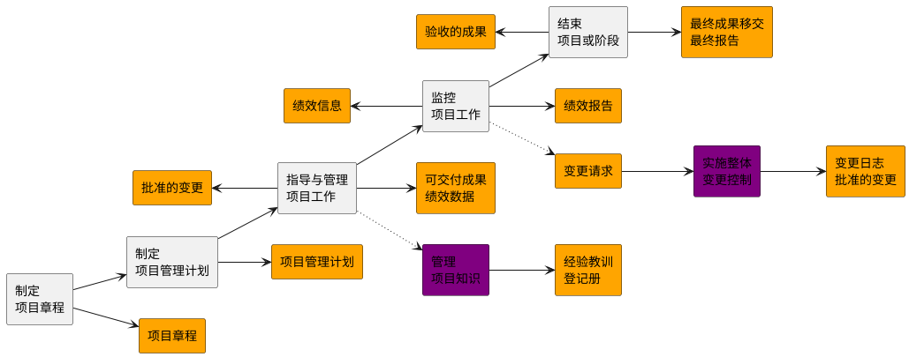

## 1. 基于过程的项目管理方法

### 1.1. 概述

*   第01章 项目整合管理
*   第02章 项目范围管理
*   第03章 项目进度管理
*   第04章 项目成本管理
*   第05章 项目质量管理
*   第06章 项目资源管理
*   第07章 项目沟通管理
*   第08章 项目风险管理
*   第09章 项目采购管理
*   第10章 项目相关方管理
*   第11章 工具与技术

### 1.2. 知识领域与项目管理过程组

| 知识领域       | 启动过程组   | 规划过程组       | 执行过程组       | 监控过程组       | 收尾过程组   |
| -------------- | ------------ | ---------------- | ---------------- | ---------------- | ------------ |
| 项目整合管理   | 制定项目章程 | 制定项目管理计划 | 指导与管理项目工作，管理项目知识 | 监控项目工作，实施整体变更控制 | 结束项目或阶段 |
| 项目范围管理   |              | 规划范围管理，收集需求，定义范围，创建WBS |                  | 确认范围，控制范围 |            |
| 项目进度管理   |              | 规划进度管理，定义活动，排列活动顺序，估算活动持续时间，制定进度计划 |                  | 控制进度       |            |
| 项目成本管理   |              | 规划成本管理，估算成本，制定预算 |                  | 控制成本       |            |
| 项目质量管理   |              | 规划质量管理     | 管理质量         | 控制质量       |            |
| 项目资源管理   |              | 规划资源管理，估算活动资源 | 获取资源，建设团队，管理团队 | 控制资源       |            |
| 项目沟通管理   |              | 规划沟通管理     | 管理沟通         | 监督沟通       |            |
| 项目风险管理   |              | 规划风险管理，识别风险，实施定性风险分析，实施定量风险分析，规划风险应对 | 实施风险应对     | 监督风险       |            |
| 项目采购管理   |              | 规划采购管理     | 实施采购         | 控制采购       |            |
| 项目相关方管理 | 识别相关方   | 规划相关方参与   | 管理相关方参与   | 监督相关方参与   |            |

## 2. 项目整合管理 - 概述
*   项目整合管理包括对隶属于项目管理过程组的各种过程和项目管理活动进行识别、定义、组合、统一和协调的各个过程。在项目管理中，整合兼具统一、合并、沟通和建立联系的性质，这些行动应该贯穿项目始终。
*   项目整合管理包括以下选择：
    *   资源分配；
    *   平衡竞争性需求；
    *   研究各种备选方法；
    *   为实现项目目标而裁剪过程；
    *   管理各个项目管理知识领域之间的依赖关系。

*   项目整合管理过程包括：
    *   1.1 **制定项目章程** — 编写一份正式批准项目并授权项目经理在项目活动中使用组织资源的文件过程。
    *   1.2 **制定项目管理计划** — 定义、准备和协调项目计划的所有组成部分，并把它们整合为一份综合项目管理计划的过程。
    *   1.3 **指导与管理项目工作** — 为实现项目目标而领导和执行项目管理计划中所确定的工作，并实施已批准变更的过程。
    *   1.4 **管理项目知识** — 使用现有知识并生成新知识，以实现项目目标，并且帮助组织学习的过程。
    *   1.5 **监控项目工作** — 跟踪、审查和报告整体项目进展，以实现项目管理计划中确定的绩效目标的过程。
    *   1.6 **实施整体变更控制** — 审查所有变更请求，批准变更，管理对可交付成果、组织过程资产、项目文件和项目管理计划的变更，并对变更处理结果进行沟通的过程。
    *   1.7 **结束项目或阶段** — 终结项目、阶段或合同的所有活动的过程。

## 3. 项目整合管理 - 核心概念
*   项目整合管理由项目经理负责。
    *   虽然其他知识领域可以由相关专家（如成本分析专家、进度规划专家、风险管理专家）管理，但是**项目整合管理的责任不能被授权或转移**。
    *   **只能由项目经理负责整合所有其他知识领域的成果，并掌握项目总体情况**。
    *   项目经理**必须**对整个项目承担**最终**责任。

*   项目与项目管理本质上具有整合性质，例如，为应急计划制定成本估算时，就需要整合项目成本管理、项目进度管理和项目风险管理领域中的相关过程。**在识别出与各种人员配备方案有关的额外风险时，可能需要再次进行上述某个或某几个过程**。
*   **项目管理过程组的各个过程之间经常反复发生联系**。例如，在项目早期，规划过程组为执行过程组提供书面的项目管理计划；然后，随着项目的进展，规划过程组还将根据变更情况，更新项目管理计划。

*   项目整合管理指的是：
    *   确保产品、服务或成果的交付日期，项目生命周期以及效益管理计划这些方面保持一致；
    *   编制项目管理计划以实现项目目标；
    *   确保创造合适的知识并运用到项目中，并从项目中获取必要的知识；
    *   管理项目计划中活动的绩效和变更；
    *   做出针对影响项目的关键变更的综合决策；
    *   测量和监督项目进展，并采取适当措施以实现项目目标；
    *   收集关于已达成成果的数据，分析数据以获取信息，并与相关方分享信息；
    *   完成全部项目工作，正式关闭各个阶段、合同以及整个项目；
    *   管理可能需要的阶段过渡。
*   项目越复杂，相关方的期望越多样化，就需要越全面的整合方法。

## 4. 项目整合管理

### 4.1. 1.1 制定项目章程

*   项目章程在项目执行组织与需求组织之间建立起伙伴关系。在执行外部项目时,通常需要用正式
的合同来达成合作协议。这种情况下,可能仍要用项目章程来建立组织内部的合作关系,以确保
正确交付合同内容。
*   **项目章程一旦被批准,就标志着项目的正式启动。**
*   在项目中,应尽早确认并任命项目经理,最好在制定项目章程时就任命,且总应在规划开始之前
任命。
*   项目章程可由发起人编制,或者由项目经理与发起机构合作编制。通过这种合作,项目经理可以
更好地了解项目目的、目标和预期效益,以便更有效地向项目活动分配资源。
*   项目章程授权项目经理规划、执行和控制项目。

* 项目由项目以外的机构来启动，如发起人、项目集或项目管理办公室 (PMO)、项目组合治理委
员会主席或其授权代表。
* **项目启动者或发起人应该具有一定的职权，能为项目获取资金并提供资源。**
* 项目可能因内部经营需要或外部影响而启动，故通常需要编制需求分析、可行性研究、商业论证
或有待项目处理的情况的描述。
* 通过编制项目章程，来确认项目符合组织战略和日常运营的需要。
* **不要把项目章程看作合同，因为其中未承诺报酬或金钱或用于交换的对价**。

#### 4.1.1. 1.1.1 商业文件

*   在商业论证和效益管理计划中，可以找到项目目标以及项目对业务目标的贡献的相关信息。
*   **虽然商业文件是在项目之前制定的，但需要定期审核。**
*   **商业论证**：经批准的商业论证或类似文件是最常用于制定项目章程的商业文件。
    *   商业论证从商业视角描述必要的信息，并且据此决定项目的期望结果是否值得所需投资。
    *   高于项目级别的经理和高管们通常使用该文件作为决策的依据。
    *   一般情况下，商业论证会包含商业需求和成本效益分析，以论证项目的合理性并确定项目边界。
*   项目章程包含来源于商业文件中的相关项目信息。
*   **既然商业文件不是项目文件，项目经理就不可以对它们进行更新或修改，只可以提出相关建议。**

#### 4.1.2. 1.1.2 协议

*   协议用于定义项目初衷。
*   协议有多种形式，包括合同、谅解备忘录（MOUs）、服务水平协议（SLA）、协议书、意向书、口头协议、电子邮件或其他书面协议。
*   为外部客户做项目时，通常就以合同的形式出现。

#### 4.1.3. 1.1.2.1 项目章程

*   **项目章程是由项目启动者或发起人发布的，正式批准项目成立，并授权项目经理使用组织资源开展项目活动的文件。** 它记录了关于项目和项目预期交付的产品、服务或成果的高层级信息，例如：**2229**
    *   项目**目的**；
    *   可测量的项目**目标**和相关的**成功标准**；
    *   高层级需求；
    *   高层级项目描述、边界定义以及主要可交付成果；
    *   整体项目风险；
    *   总体里程碑进度计划；
    *   预先批准的财务资源；
    *   关键相关方名单；
    *   项目审批要求（例如，用什么标准评价项目成功，由谁对项目成功下结论，由谁来签署项目结束）；
    *   项目**退出标准**（例如，在何种条件下才能关闭或取消项目或阶段）；
    *   委派的**项目经理**及其职责和职权；
    *   **发起人**或其他批准项目章程的人员的姓名和职权。
*   项目章程确保相关方在总体上就主要可交付成果、里程碑以及每个项目参与者的角色和职责达成共识。

#### 4.1.4. 1.1.2.2 假设日志

*   通常，在项目启动之前编制商业论证时，识别高层级的战略和运营假设条件与制约因素。
*   这些假设条件与制约因素应纳入项目章程。
*   较低层级的活动和任务假设条件在项目期间随着诸如定义技术规范、估算、进度和风险等活动的开展而生成。
*   **假设日志用于记录整个项目生命周期中的所有假设条件和制约因素。**

### 4.2. 1.2 制定项目管理计划

*   制定项目管理计划是定义、准备和协调项目计划的所有组成部分，并把它们整合为一份综合项目管理计划的过程。本过程的主要作用是，生成一份综合文件，用于确定所有项目工作的基础及其执行方式。
*   项目管理计划确定项目的执行、监控和收尾方式，其内容会因项目所在的的应用领域和复杂程度而异。
*   项目管理计划可以是概括或详细的，而每个组成部分的详细程度取决于具体项目的要求。
*   项目管理计划应足够强大，可以应对不断变化的项目环境。
*   这种敏捷性有利于随项目进展产出更准确的信息。
*   **项目管理计划应基准化，即至少应规定项目的范围、时间和成本方面的基准，以便据此考核项目执行情况和管理项目绩效。**
*   在确定基准之前，可能要对项目管理计划进行多次更新，且这些更新需遵循正式流程。
*   但是，一旦确定了基准，就只能通过实施整体变更控制过程进行更新。
*   在这种情况下，如果需要进行变更，应提出变更请求以待决定。
*   这一过程将形成一份项目管理计划。在项目收尾之前，该计划需要通过不断更新来渐进明细，且这些更新需要得到控制和批准。
*   对隶属于项目集或项目组合的项目，则应该制定与项目集或项目组合管理计划相一致的项目管理计划。
*   例如，项目集管理计划中要求超过某一特定成本的所有变更都需要上报变更控制委员会（CCB）审查，在项目管理计划中就应该对审查流程和成本临界值做出相应规定。

#### 4.2.1. 1.2.1.1 项目章程

*   项目团队把项目章程作为初始项目规划的起始点。
*   项目章程所包含的信息种类数量因项目的复杂程度和已知的信息而异。
*   在项目章程中至少应该定义项目的高层级信息,供将来在项目管理计划的各个组成部分中进一步细化。

#### 4.2.2. 1.2.1.2 其他过程的输出

*   创建项目管理计划需要整合诸多过程的输出。
*   其他规划过程所输出的子计划和基准都是本过程的输入。
*   此外,对这些子计划和基准的变更都可能导致对项目管理计划的相应更新。

#### 4.2.3. 1.2.2.1 项目管理计划

*   项目管理计划是说明项目执行、监控和收尾方式的一份文件，它整合并综合了所有子项目计划和基准，以及管理项目所需的其他信息。
*   究竟需要哪些项目管理计划组件，取决于具体项目的需求。
*   项目管理计划组件包括（但不限于）：**9331**
*   子管理计划：
    *   范围管理计划： 确立如何定义、制定、监督、控制和确认项目范围。
    *   **需求管理计划：** 确定如何分析、记录和管理需求。
    *   进度管理计划： 为编制、监督和控制项目进度建立准则并确定活动。
    *   成本管理计划：确定如何规划、安排和控制成本。
    *   质量管理计划：确定在项目中如何实施组织的质量政策、方法和标准。
    *   资源管理计划：指导如何对项目资源进行分类、分配、管理和释放。
    *   沟通管理计划：确定项目信息将如何、何时、由谁来进行管理和传播。
    *   风险管理计划：确定如何安排与实施风险管理活动。
    *   采购管理计划：确定项目团队将如何从执行组织外部获取货物和服务。
    *   相关方参与计划：确定如何根据相关方的需求、利益和影响让他们参与项目决策和执行。
*   其他组件：大多数项目管理计划组件都来自于其他过程，虽然有些组件是在本过程生成的。虽然在本过程生成的组件会因项目而异，但是通常包括（但不限于）：
    *   **变更管理计划：** 描述在整个项目期间如何正式审批和采纳变更请求。
    *   **配置管理计划：** 描述如何记录和更新项目的特定信息，以及该记录和更新哪些信息，以保持产品、服务或成果的一致性（和）有效性。
    *   项目生命周期：描述项目从开始到结束所经历的一系列阶段。
    *   开发方法：描述产品、服务或成果的开发方法，例如预测、迭代、敏捷或混合型模式。
    *   管理审查：确定项目经理和相关方审查项目进展的时间点，以考核绩效是否符合预期，或者确定是否有必要采取预防或纠正措施。
*   **基准：**
    *   **范围基准：** 经过批准的范围说明书、工作分解结构（WBS）和相应的WBS词典，用作比较依据。
    *   **进度基准：** 经过批准的进度模型，用作与实际结果进行比较的依据。
    *   **成本基准：** 经过批准的、按时间段分配的项目预算，用作与实际结果进行比较的依据。
    *   **绩效测量基准：** 经过整合的项目范围、进度和成本计划，用作项目执行的比较依据，以测量和管理项目绩效。
