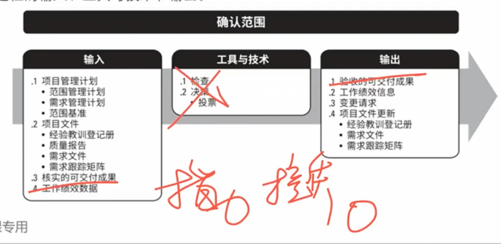

# 2、项目范围管理

## 本章概述
* 2.1 规划范围管理
* 2.2 收集需求
* 2.3 定义范围
* 2.4 创建WBS
* 2.5 确认范围
* 2.6 控制范围

## 项目范围管理 - 概述
* 项目范围管理包括确保项目**只做**所需的全部工作，以成功完成项目的各个过程。管理项目范围主要在于定义和控制**哪些工作应该包括在项目内**，**哪些不应该包括在项目内**。
* 项目范围管理过程包括：
    * **2.1 规划范围管理** — 为记录如何定义、确认和控制项目范围及产品范围，而创建范围管理计划的过程。
    * **2.2 收集需求** — 为实现项目目标而确定、记录并管理相关方的需要和需求的过程。
    * **2.3 定义范围** — 制定项目和产品详细描述的过程。
    * **2.4 创建WBS** — 将可交付成果和项目工作分解为较小的、更易于管理的组件的过程。
    * **2.5 确认范围** — 正式验收已完成的项目可交付成果的过程。
    * **2.6 控制范围** — 监督项目和产品的范围状态，管理范围基准变更的过程。

## 项目范围管理 - 核心概念
* 在项目环境中，“范围”这一术语有两种含义：
    * **产品范围**。某项产品、服务或成果所具有的特征和功能。
    * **项目范围**。为交付具有规定特性与功能的产品、服务或成果而必须完成的工作。
* 项目范围的完成情况是根据项目管理计划来衡量的，而产品范围的完成情况是根据产品需求来衡量的。在这里，“需求”是指根据特定协议或其他强制性规范，产品、服务或成果必须具备的条件或能力。

* **确认范围**是**正式验收**已完成的项目可交付成果的**过程**。
* 从**控制质量过程**输出的**核实的可交付成果**是**确认范围过程的输入**，而**验收的可交付成果**是**确认范围过程的输出之一**，由获得授权的相关方正式签字批准。
* 因此，相关方需要在规划阶段早期介入（有时需要在启动阶段就介入），对可交付成果的质量提出意见，以便控制质量过程能够据此评估绩效并提出必要的变更建议。

## 2.1 规划范围管理
* 规划范围管理是为记录如何定义、确认和控制项目范围及产品范围，而创建范围管理计划的过程。本过程的主要作用是，在整个项目期间如何对管理范围提供指南和方向。

### 2.1.2.1 范围管理计划
* 范围管理计划是项目管理计划的组成部分，描述将**如何定义**、制定、监督、控制和确认项目范围。
* 范围管理计划要对将用于下列工作的管理过程做出规定：
    * 制定项目范围说明书；
    * 根据详细项目范围说明书创建WBS；
    * 确定如何审批和维护范围基准；
    * 正式验收已完成的项目可交付成果。
* 根据项目需要，范围管理计划可以是正式或非正式的，非常详细或高度概括的。

### 2.1.2.2 需求管理计划
* 需求管理计划是项目管理计划的组成部分，描述将**如何分析**、记录和管理项目和产品**需求**。
* 《从业者商业分析：实践指南》，有些组织称之为“商业分析计划”。
* 需求管理计划的主要内容包括（但不限于）：
    * 如何规划、跟踪和报告各种需求活动；
    * 配置管理活动，例如，如何启动变更，如何分析其影响，如何进行追溯、跟踪和报告，以及变更审批权限；
    * 需求优先级排序过程；
    * 测量指标及使用这些指标的理由；
    * 反映哪些需求属性将被列入跟踪矩阵的跟踪结构。

## 2.2 收集需求
* 收集需求是为实现目标而确定、记录并管理相关方的需要和需求的过程。本过程的主要作用是，为定义产品范围和项目范围奠定基础。

### 2.2.1.1 项目章程
* 项目章程记录了项目概述以及将用于制定详细需求的高层级需求。

### 2.2.1.2 项目管理计划
* 项目管理计划组件包括(但不限于) :
    * 范围管理计划。范围管理计划包含如何定义和制定项目范围的信息。
    * 需求管理计划。需求管理计划包含如何收集、分析和记录项目需求的信息。
    * 相关方参与计划。从相关方参与计划中了解相关方的沟通需求和参与程度，以便评估并适应相关方对需求活动的参与程度。

### 2.2.1.3 项目文件
* 可作为本过程输入的项目文件包括(但不限于) :
    * 假设日志。假设日志识别了有关产品、项目、环境、相关方以及会影响需求的其他因素的假设条件。
    * 经验教训登记册。经验教训登记册提供了有效的需求收集技术，尤其针对使用迭代型或适应型产品开发方法的项目。
    * **相关方登记册。相关方登记册用于了解哪些相关方能够提供需求方面的信息，及记录相关方对项目的需求和期望。**

### 2.2.2.1 需求文件
* 需求的类别包括：
    * **业务需求**。整个组织的高层级需要，例如，解决业务问题或抓住业务机会，以及实施项目的原因。
    * **相关方需求**。相关方或相关方群体的需要。
    * **解决方案需求**。为满足业务需求和相关方需求，产品、服务或成果必须具备的特性、功能和特征。解决方案需求又进一步分为功能需求和非功能需求：
        * **功能需求**。功能需求描述产品应具备的功能，例如，产品应该执行的行动、流程、数据和交互。
        * **非功能需求**。非功能需求是对功能需求的补充，是产品正常运行所需的环境条件或质量要求，例如，可靠性、保密性、性能、安全性、服务水平、可支持性、保留或清除等。

### 2.2.2.2 需求跟踪矩阵
* 需求跟踪矩阵是把产品需求从其来源连接到能满足需求的可交付成果的一种表格。
* **使用需求跟踪矩阵，把每个需求与业务目标或项目目标联系起来，有助于确保每个需求都具有商业价值。**
* 需求跟踪矩阵提供了在整个项目生命周期中跟踪需求的一种方法，*有助于***确保需求文件**中被批准的每项需求在项目结束的时候都能交付。
* 最后，需求跟踪矩阵还为管理产品范围变更提供了框架。

## 2.3 定义范围
* 定义范围是制定**项目和产品详细描述**的过程。本过程的主要作用是，描述**产品、服务或成果**的边界和验收标准。

* 由于*在收集需求过程申识别出的所有需求**未必***都包含在项目中，所以**定义范围过程**就要从需求文件(收集需求过程的输出)中选取最终的项目需求，然后制定出关于项目**及其产品、服务或成果**的详细描述。
* 准备好详细的**项目范围说明书**，对**项目成功**至关重要。

### 2.3.2.1 项目范围说明书
* 项目范围说明书描述要做和不要做的工作的详细程度，决定着项目管理团队控制整个项目范围的有效程度。详细的项目范围说明书包括以下内容（可能直接列出或参考其他文件）：
    * **产品范围描述**。逐步细化在项目章程和需求文件中所述的产品、服务或成果的特征。
    * **项目范围描述**。为交付具有规定特性与功能的产品、服务或成果而必须完成的工作。
    * **可交付成果**。为完成某一过程、阶段或项目而必须产出的任何独特并可核实的产品、成果或服务能力，可交付成果也包括各种辅助成果，如项目管理报告和文件。对可交付成果的描述可略可详。
    * **验收标准**。可交付成果通过验收前必须满足的一系列条件。
    * **项目的除外责任**。识别排除在项目之外的内容。明确说明哪些内容不属于项目范围，有助于管理相关方的期望及减少范围蔓延。

## 2.4 创建WBS
* 创建工作分解结构（WBS）是把项目可交付成果和项目工作分解成较小、更易于管理的组件的过程。本过程的主要作用是，为所要交付的内容提供架构。

* WBS**组织**并**定义**了项目的总范围，代表着经批准的当前项目范围说明书中所规定的工作。
* **WBS最低层**的组成部分称为**工作包**，其中包括计划的工作。
* 工作包对相关活动进行归类，以便对工作安排进度、进行估算、开展监督与控制。
* 在"工作分解结构”这个词语中，"**工作**”是指作为活动结果的工作产品或可交付成果，而不是活动本身。

### 2.4.2.1 范围基准
* **范围基准是经过批准的范围说明书、WBS和相应的WBS词典，只有通过正式的变更控制程序才能进行变更，它被用作比较的基础。**
* **范围基准**是项目管理计划的组成部分，包括：
    * **WBS项目范围说明书。**项目范围说明书包括对项目范围、主要可交付成果、假设条件和制约因素的描述。
    * **WBS**。WBS词典是针对WBS的每个组件，详细描述可交付成果、活动和进度信息的文件。WBS词典对WBS提供支持，其中大部分信息由其他过程创建，然后在后期添加到词典中。WBS词典中的内容可能包括（但不限于）：**9个知识领域的内容**
        * 账户编码标识；
        * 工作描述；
        * 假设条件和制约因素；
        * 负责的组织；
        * 进度里程碑；
        * 相关的进度活动；
        * 所需资源；
        * 成本估算；
        * 质量要求；
        * 验收标准；
        * 技术参考文献；
        * 协议信息。

   * **工作包**。WBS的**最底层级**是带有独特标识的工作包。这些标识为进行成本、进度和资源信息的逐层汇总提供了层级结构，构成账户编码。**每个**工作包都是**控制账户**的一部分，而**控制账户**是一个管理控制点。在该控制点上，把范围、预算和进度加以整合，并与挣值相比较，以测量绩效。**控制账户拥有两个或更多工作包，但每个工作包只与一个控制账户关联。**
   * **规划包**。一个控制账户可以包含一个或多个规划包，是一种低于**控制账户**而**高于工作包**的工作分解结构组件，工作内容已知，但详细的进度活动未知。

## 2.5 确认范围
* 确认范围是正式验收已完成的项目可交付成果的过程。本过程的主要作用是，使验收过程具有客观性；同时通过确认每个可交付成果，来提高最终产品、服务或成果获得验收的可能性。

*   由**客户或发起人**审查从**控制质量过程**输出的**核实的可交付成果**，确认这些可交付成果已经圆满完成并通过正式验收。本过程对可交付成果的确认和最终验收,需要依据：从项目范围管理知识领域的各规划过程获得的输出(如需求文件或范围基准),以及从其他知识领域的各执行过程获得的工作绩效数据。

*   确认范围过程与控制质量过程的不同之处在于，前者关注**可交付成果的验收**，而后者关注**可交付量成果的正确性及是否满足质量要求**。控制质量过程通常先于确认范围过程,但二者也可同时进行。

### 2.5.1.4 工作绩效数据
* 工作绩效数据可能包括**符合需求的程度**、**不一致的数量**、**不一致的严重性**或在某时间段内开展确认的次数。

### 2.5.2.1 验收的可交付成果
* 符合验收标准的可交付成果应该由客户或发起人**正式签字批准**。
* 应该从客户或发起人那里获得**正式文件**，证明相关方对项目可交付成果的**正式验收**。
* 这些文件将提交给结束项目或阶段过程。

### 2.5.2.2 工作绩效信息
* 工作绩效信息包括项目进展信息，例如，**哪些可交付成果已经被验收**，**哪些未通过验收**以及原因。
* 这些信息应该被记录下来并传递给相关方。

## 2.6 控制范围
* 控制范围是**监督**项目和产品的范围**状态**，**管理**范围基准**变更**的过程。处理。本过程的主要作用是，在整个项目期间保持对范围基准的维护，且**需要在整个项目期间开展**。

* 控制项目范围确保**所有**变更请求、推荐的纠正措施或预防措施**都通过实施整体变更控制过程**进行处理。在变更实际发生时，也要采用控制范围过程来管理这些变更。控制范围过程应该与其他控制过程协调开展。
* **未经控制的产品项目范围的扩大**（未对时间、成本和资源做相应调整）被称为**范围蔓延**。变更不可避免，因此在每个项目上，都必须强制实施某种形式的变更控制。