## 项目进度管理 - 概述

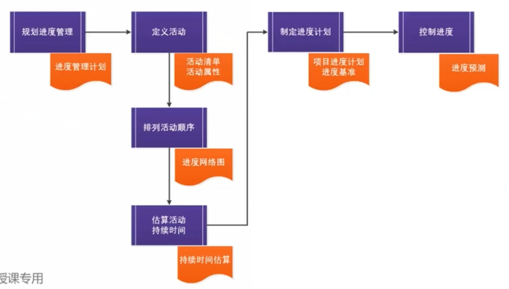

*   项目进度管理包括为管理项目按时完成所需的各个过程。其过程包括：
    *   **3.1 规划进度管理**— 为规划、编制、管理、执行和控制项目进度而制定政策、程序和文档的过程。
    *   **3.2 定义活动**— 识别和记录为完成项目可交付成果而需采取的具体行动的过程。
    *   **3.3 排列活动顺序**— 识别和记录项目活动之间的关系的过程。
    *   **3.4 估算活动持续时间**一 根据资源估算的结果，估算完成单项活动所需工作时段数的过程。
    *   **3.5 制定进度计划**一 分析活动顺序、持续时间、资源需求和进度制约因素，创建项目进度模型，从而落实项目执行和监控的过程。
    *   **3.6 控制进度** 一 监督项目状态，以更新项目进度和管理进度基准变更的过程。

## 项目进度管理 - 核心概念

*   **项目进度计划**提供**详尽**的计划，**说明**项目如何以及**何时**交付项目**范围**中定义的产品、服务和成果，是一种用于沟通和管理相关方期望的工具，为绩效报告提供了依据。
*   项目管理团队选择进度计划方法，例如关键路径法或敏捷方法。
    *   之后，项目管理团队将项目特定数据，如活动、计划日期、持续时间、资源、依赖关系和制约因素等输入进度计划编制工具，以创建项目进度模型。
    *   这件工作的成果就是项目进度计划。
    *   下图是进度计划工作的概览，展示如何结合进度计划编制方法、编制工具及项目进度管理各过程的输出来创建进度模型。

## 3.1 规划进度管理

*   规划进度管理是为 **规划**、**编制**、**管理**、**执行**和**控制项目进度**而制定政策、程序和文档的过程。
*   本过程的主要作用是，为 **如何**在整个项目期间 **管理项目进度**提供 **指南和方向**。
*   

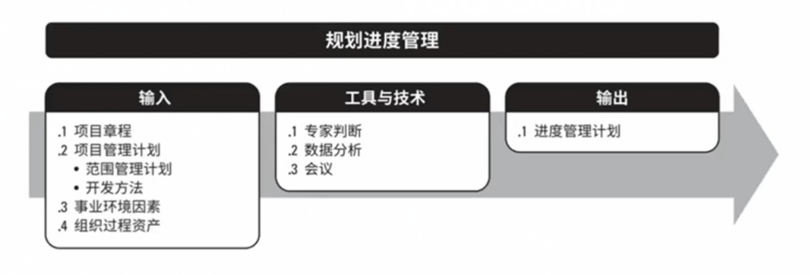

### 3.1.2.1 进度管理计划

*   进度管理计划是 **项目管理计划(9331)**的组成部分，为 编制、监督和控制项目进度建立准则和明确活动。根据项目需要，进度管理计划可以是 **正式** 或 **非正式** 的，**非常详细** 或 **高度概括** 的，其中应包含合适的 **控制临界值**。
*   进度管理计划会规定:
    *   项目进度模型制定。需要规定用于指定项目进度模型的进度规划方法论和工具。
    *   **准确度**。 准确度定义了需要规定活动持续时间估算的可接受区间，以及允许的应急储备数量。
    *   **控制临界值。  可能需要规定偏差临界值，用于监督进度绩效。它是在需要采取某种措施前，允许出现的最大差异。**临界值通常用偏离基准计划中的参数的某个百分比来表示。
    *   报告格式。

## 3.2 定义活动

*   **定义活动**是 **识别** 和 **记录** 为完成项目可交付成果而采取的具体行动的过程。 本过程的主要作用是，将 **工作包分解为进度活动**，作为对项目工作进行进度估算、规划、执行、监督和控制的基础。

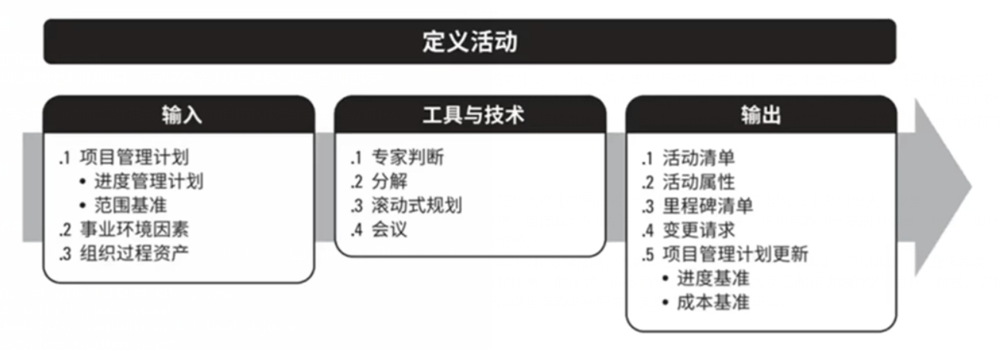

### 3.2.2.1 活动清单

*   活动清单包含项目所需的进度活动。
*   对于使用滚动式规划或敏捷技术的项目，活动清单会在项目进展过程中得到定期更新。
*   活动清单包括每个活动的标识符和工作范围详述，使项目团队成员知道需要完成什么工作。

### 3.2.2.2 活动属性
*   WBS 词典

### 3.2.2.3 里程碑清单

*   里程碑是项目中的重要时间点或事件，里程碑清单列出了所有项目里程碑，并指明每个里程碑是强制性的 (如合同要求的) 还是选择性的 (如根据历史信息确定的)。
*   里程碑的 **持续时间为零**，因为它们代表的是一个 **重要时间点或事件**。

## 3.3 排列活动顺序

*   排列活动顺序是识别和记录项目活动之间的关系的过程。 本过程的主要作用是定义工作之间的逻辑顺序，以便在既定的所有项目制约因素下获得最高的效率。

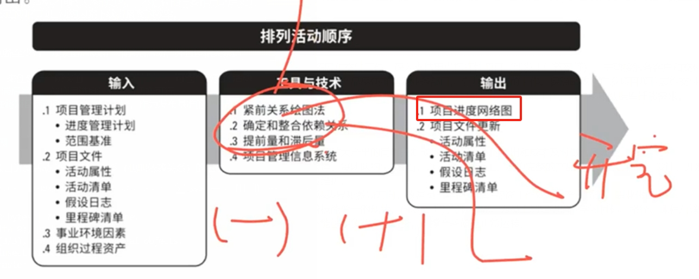

*   除了首尾两项，每项活动都至少有一项紧前活动和一项紧后活动，并且逻辑关系适当。
*   通过 **设计逻辑关系** 来创建一个切实的 **项目进度计划**，可能有必要在活动之间使用 **提前量** 或 **滞后量**，使项目进度计划更为切实可行。
*   **排列活动顺序过程旨在将项目活动列表转化为图表**，作为发布基准的第一步。

### 3.3.2.1 项目进度网络图

*   项目进度网络图是表示项目进度活动之间的逻辑关系 (也叫依赖关系) 的图形。
*   下图是项目进度网络图的一个示例。

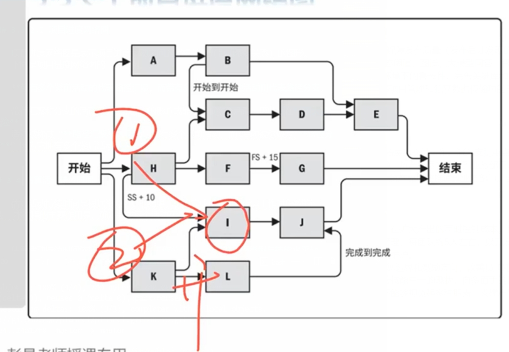

*   **带有多个紧前活动的代表路径汇聚，而带有多个紧后活动的活动则代表路径分支。**
*   带有汇聚和分支的活动受到多个活动的影响或能够影响多个活动，因此存在**更大的风险**。
*   活动被称做 “**路径汇聚**”,因为它拥有多个紧前活动，而K活动被称做为“**路径分支**” 因为它拥有多个紧后活动.

## 3.4 估算活动持续时间

*   估算活动持续时间是根据资源估算的结果，估算完成单项活动所需工作时段数的过程。 本过程的主要作用是，确定完成每个活动花费的时间量。

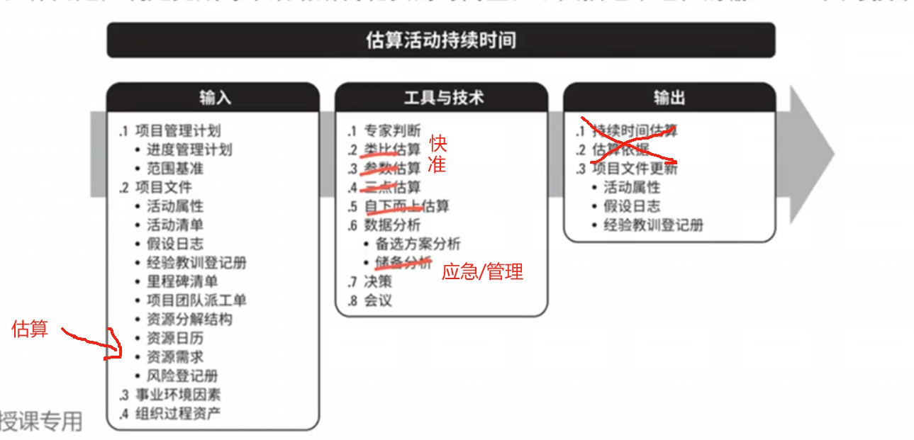

*   估算活动持续时间依据的信息包括 **工作范围**、**所需资源类型与技能水平**、**估算的资源数量和资源日历**，而可能影响持续时间估算的其他因素包括对持续时间受到的约束、相关人力投入、资源类型（如固定持续时间、固定人力投入或工作、固定资源数量）以及所采用的进度网络分析技术。

*  **应该由项目团队中最熟悉具体活动的个人或小组提供持续时间估算所需的各种输入，对持续时间的估算也应逐渐明细，取决于输入数据的数量和质量。**

*   在本过程中，应首先估算出完成活动所需的 **工作量** 和计划投入该活动的 **资源数量**，然后结合**项目日历**和**资源日历**，据此估算出完成活动所需的 **工作时段 （活动持续时间）**。
*   在许多情况下，**预计可用的资源数量**以及这些 **资源的技能熟练程度** 可能会决定 **活动的持续时间**。
*   有时候，因为工作的特性（即受到持续时间的约束、相关人力投入或资源数量），无论资源分配如何（如24小时应力测试），都需要花预定的时间才能完成工作。

*   估算持续时间时需要考虑的其他因素包括：
    *   **收益递减规律**。在保持其他因素不变的情况下，增加一个用于确定单位产出所需投入的因素(如资源)会最终达到一个临界点，在该点之后的产出或输出会随着增加这个因素而递减。
    *   **资源数量**。 增加资源数量，使其达到初始数量的两倍不一定能缩短一半的时间，因为这样可能会因风险而造成持续时间增加； 在某些情况下，如果增加太多活动资源，可能会因知识传递、学习曲线、额外合作等其他相关因素而造成持续时间增加。
    *   **员工激励**。项目经理还需要了解**“学生综合征”（**即拖延症**）和**帕金森定律**，前者指出，人们只有在最后一刻，即快到期限时才会全力以赴； 后者指出，只要还有时间，工作就不会不断扩展，直到用完所有的时间的。

### 3.4.1.2 项目文件

*   可作为本过程输入的所有项目文件包括 (但不限于)：
    *   资源分解结构。
    *   **资源日历**。资源日历规定了在项目期间特定的项目资源何时可用及可用多久。
    *   **资源需求**。估算的活动资源需求会对活动持续时间产生影响。对于大多数活动来说，所分配的资源能否达到要求，将对其持续时间有显著影响。
    *   风险登记册。

### 3.4.2.2 估算依据

*   持续时间估算所需的支持信息的数量和种类，因应用领域而异。不论其详细程度如何，支持性文件**都应该清晰，完整地说明持续时间估算是如何得出的。**

## 3.5 制定进度计划

*   制定进度计划是**分析活动顺序、持续时间、资源需求和进度制约因素**，创建进度模型，从而落实项目执行和监控的过程。

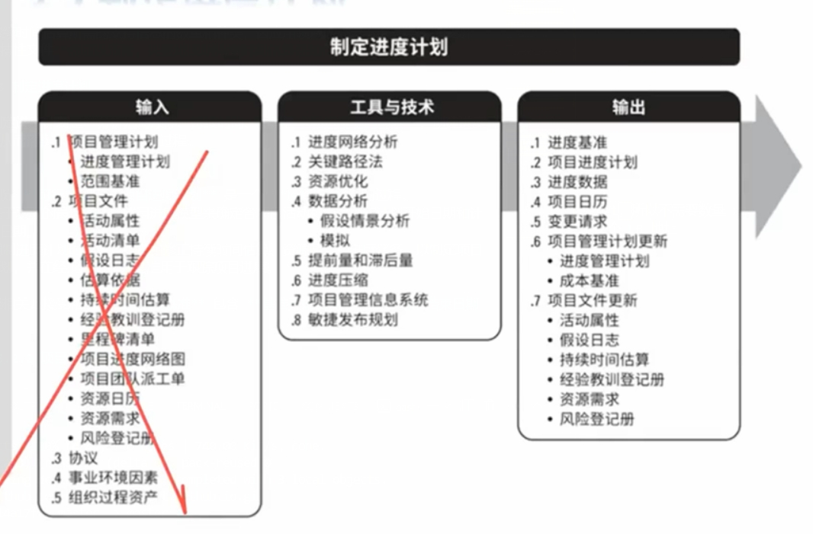

*   制定 **可行** 的 **项目进度计划** 是一个 **反复进行** 的过程。
*   基于获取的最佳信息，使用进度模型来确定各项目活动和里程碑的计划开始日期和计划完成日期。
*   编制进度计划时，需要审查和修正持续时间估算、资源估算和进度储备，以制定项目进度计划，并在经批准后作为基准用于跟踪项目进度。

### 3.5.2.1 进度基准

*   进度基准是经过批准的进度模型，只有通过正式的变更控制程序才能进行变更，用作与实际结果进行比较的依据。
*   经相关方接受和批准，**进度基准** 包含 **基准开始日期** 和 **基准结束日期**。
*   在监控过程中，将用实际开始和完成日期与批准的基准日期进行比较，以确定是否存在偏差。
*   进度基准是项目管理计划的组成部分。

### 3.5.2.2 项目进度计划

*   可以采用以下一种或多种图形来呈现：

    *   **横道图**。也叫“概括性进度计划”。

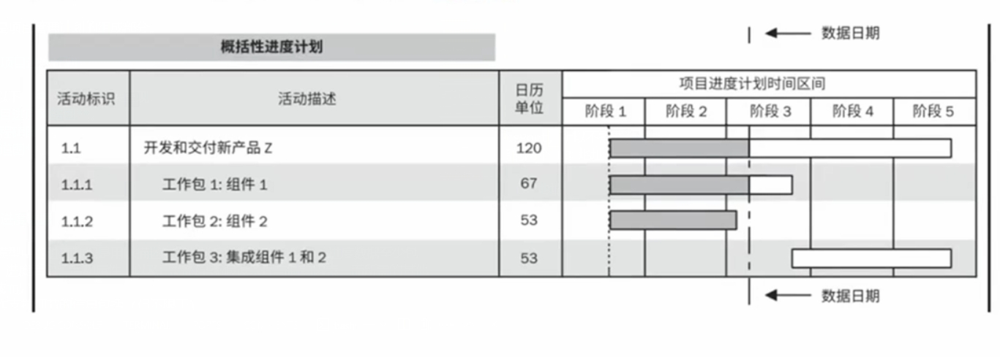

    *   **项目进度网络图**。这些图形通常用**活动节点法**绘制，**没有时间刻度**,纯粹显示活动及其相互关系，有时也称为““**纯逻辑图**”。
        *   项目进度网络图也可以是包含时间刻度的进度网络图，有时称为“逻辑横道图”，如下图中的详细进度计划所示。
        *   这些图形中有活动日期，通常会同时展示项目网络逻辑和项目关键路径活动等信息。本例子也显示了如何通过一系列相关活动来对每个工作包进行规划。
        *   **项且进度网络图的另一种呈现形式是“时标逻辑图”**，其中包含时间刻度和表示活动持续时间的横条，以及活动之间的逻辑关系。它们用于优化展现活动之间的关系，许多活动都可以按顺序出现在图的同一行中。

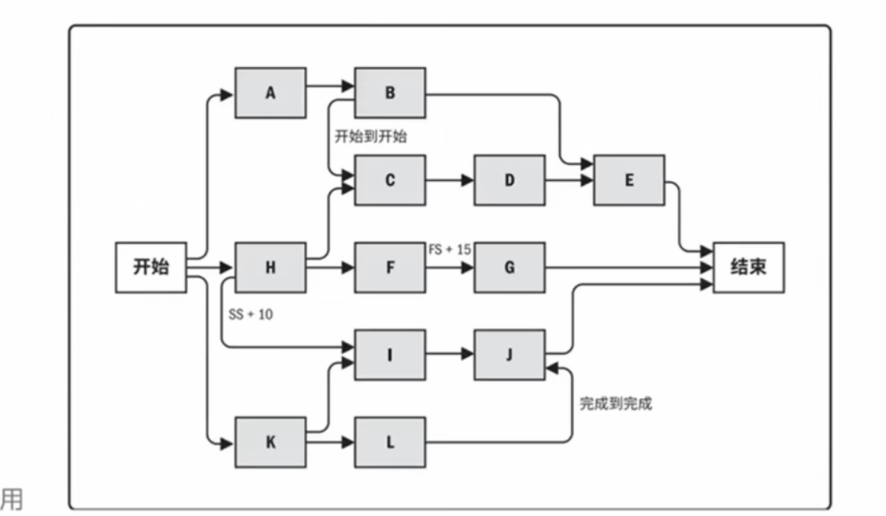

    *   **里程碑图**。也叫“里程碑进度计划”。

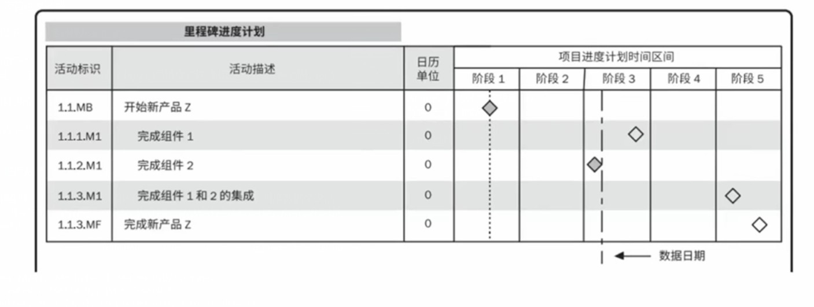

    *   **详细进度计划**。也叫“项目进度关联横道图”。

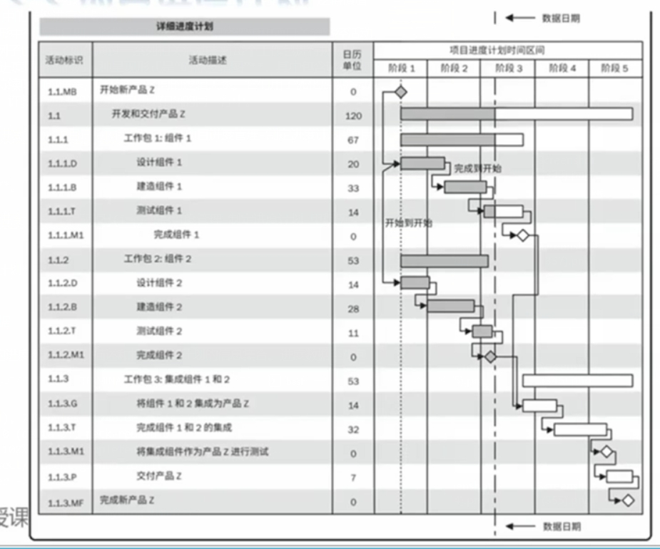

### 3.5.2.3 进度数据

*   项目进度模型中的进度数据是用以描述和控制进度计划的信息集合。进度数据至少包括进度里程碑、进度活动、活动属性，以及已知的全部假设条件与制约因素，而所需的其他数据因应用领域而异。
*   经常可用作支持细节的信息包括 (但不限于)：
    *   按时段计划的资源需求，往往以 **资源直方图** 表示。
    *   备选的进度计划，如最好情况或最坏情况下的进度计划、经资源平衡或未经资源平衡的进度计划、有强制日期或无强制日期的进度计划;
    *   使用的进度储备
    *   进度数据还可包括资源直方图、现金流预测，以及订购与交付进度安排等其他相关信息。

### 3.5.2.4 项目日历
*   在项目日历中规定可以开展进度活动的可用工作日和工作班次，它把可用于开展进度活动的时间段(按天或更小的时间单位)与不可用的时间段区分开来。
*   在一个进度模型中，可能需要采用不止一个项目日历来编制项目进度计划，因为有些活动需要不同的工作时段。因此，可能需要对项目日历进行更新。

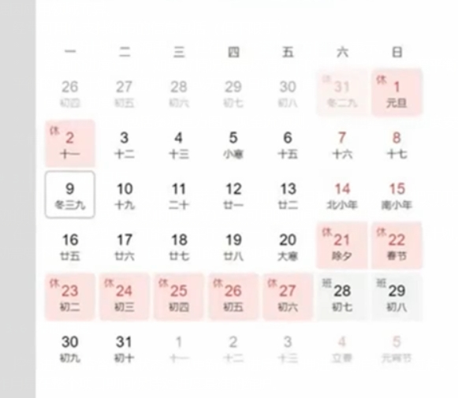

## 3.6 控制进度

*   控制进度是监督项目状态，以更新项目进度和管理进度基准变更的过程。本过程的主要作用是在整个项目期间保持对进度基准的维护。

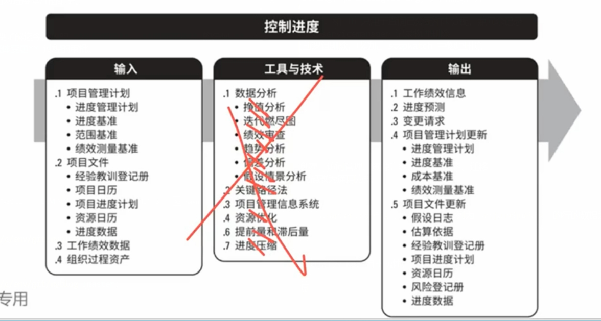

*   要更新进度模型，就需要了解迄今为止的 **实际绩效**。 **进度基准** 的任何 **变更**都必须经过 **实施整体变更** 过程的审批。

