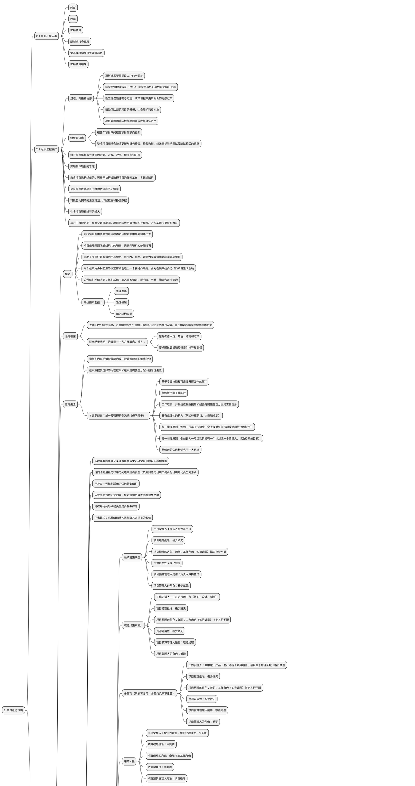

**2、项目运行环境**

* 本章综述
  * 2.1 事业环境因素
  * 2.2 组织过程资产
  * 2.3 组织系统

**2.1 事业环境因素**

* 事业环境因素（EEFs）是指项目团队不能控制的，将对项目产生影响、限制或指令作用的各种条件。
  * 这些条件可能来自于组织的<u>内部</u>和（或）<u>外部</u>。
  * <u>事业环境因素</u>是很多项目管理过程，尤其是大多数规划过程的输入。
  * 这些因素可能会提高或限制项目管理的灵活性，并可能对项目结果产生积极或消极的影响。
* 从性质或类型上讲，<u>事业环境因素</u>是多种多样的。有效开展项目，就必须考虑这些因素。<u>事业环境因素</u>包括（但不限于）下方小节所描述的因素。

**2.2 组织过程资产**

* 组织过程资产是执行组织所特有并使用的计划、<u>过程</u>、<u>政策</u>、<u>程序</u>和<u>知识库</u>，会影响对具体项目的管理。
*  组织过程资产包括来自任何（或所有）项目执行组织的，可用于执行或治理项目的任何工作、实践或知识，还包括来自组织以往项目的经验教训和历史信息。组织过程资产可能还包括完成的进度计划、<u>风险数据</u>和<u>挣值数据</u>。
*  组织过程资产是许多项目管理过程的输入。由于组织过程资产存在于组织内部，在整个项目期间，项目团队成员可对组织过程资产进行必要的更新和增补。

* 组织过程资产可分成以下两大类：
   * <u>过程</u>、<u>政策</u>和<u>程序</u>
   * <u>组织知识库</u>
* 第一类资产的更新通常不是项目工作的一部分，而是由项目管理办公室 (PMO) 或项目以外的其他职能部门完成。更新工作仅仅遵循与<u>过程</u>、<u>政策</u>和<u>程序</u>更新相关的组织政策。 有些组织鼓励团队裁剪项目的模板、生命周期和核对单。在这种情况下，项目管理团队应根据项目需求裁剪这些资产。
* 第二类资产是在整个项目期间结合项目信息而更新的。例如，整个项目期间会持续更新与财务绩效、经验教训、绩效指标和问题以及缺陷相关的信息。

**2.3 组织系统**

**2.3.1 概述**

*   运行项目时需要应对组织结构和治理框架带来的制约因素。为有效且高效地开展项目，项目经理需要了解组织内的职责、责责和职权的分配情况。这有助于项目经理有效利用其权力、影响力、能力、领导力和政治能力成功完成项目。
*   *单个组织内多种因素的交互影响创造出一个独特的系统，会对在该系统内运行的项目造成影响。*这种组织系统决定了组织系统内部人员的权力、影响力、利益、能力和政治能力。系统因素包括（但不限于）：
    *   <u>管理要素</u>；
    *   <u>治理框架</u>；
    *   <u>组织结构类型</u>。

**2.3.2 组织治理框架**

*   近期的PMI研究指出，<u>治理</u>指组织各个层面的有组织的或有结构的安排，旨在确定和影响组织成员的行为。研究结果表明，<u>治理</u>是一个多方面概念，并且：
    *   包括考虑<u>人员</u>、<u>角色</u>、<u>结构</u>和<u>政策</u>；
    *   要求通过<u>数据</u>和<u>反馈</u>提供<u>指导</u>和<u>监督</u>。

**2.3.3 管理要素**

*   <u>管理要素</u>指组织内部关键职能部门或一般管理原则的组成部分。组织根据其选择的<u>治理框架</u>和<u>组织结构类型</u>分配一般管理要素。
*   关键职能部门或一般管理原则包括（但不限于）：
    *   基于<u>专业技能</u>和<u>可用性</u>开展工作的部门；
    *   组织授予的工作职权；
    *   <u>工作职责</u>，开展组织根据<u>技能</u>和<u>经验</u>等属性合理分派的工作任务；
    *   具有<u>纪律性</u>的行为（例如<u>尊重职权</u>、<u>人员</u>和<u>规定</u>）；
    *   <u>统一指挥原则</u>（例如一位员工仅接受一个上级对任何行动或活动给出的指示）；
    *   <u>统一领导原则</u>（例如针对一项活动只能有一个计划或一个领导人，以及相同的目标）；
    *   组织的总体目标优先于个人目标；

**2.3.4 组织结构类型**

*   组织需要权衡两个关键变量之后才可确定合适的组织结构类型。
*   这两个变量指可以采用的组织结构类型以及针对特定组织如何优化组织结构类型的方式。
*   *不存在一种结构适用于任何特定组织。*
*   因为要考虑各种可变因素，特定组织的最终结构是独特的。
*   组织结构的形式或类型是多种多样的。
*   下表比较了几种组织结构类型及其对项目的影响。

*组织结构类型*  | *工作安排人* |  *项目经理批准*  |  *项目经理的角色*  | *资源可用性* | *项目预算管理人是谁？*  | *项目管理人是谁？*  
:------------- | :-----------: | :-----------: | :-----------: | :-----------: | :-----------: | :-----------:
职能（集中式）  |  正在进行的工作 (例如：设计，制造)   | 极少或无   | 兼职；工作角色（如协调员）指定与否不限  | 极少或无 | 职能经理 | 兼职
多部门(职能可跨部门，各部门几乎不重叠) | 其中之一产品；生产过程；项目组合；项目集；地理区域；客户类型 | 极少或无 | 兼职；工作角色（如协调员）指定与否不限 | 极少或无 | 职能经理 | 兼职
矩阵 - 强 | 按工作职能，项目经理作为一个职能  | 中到高  |  全职指定工作角色 | 中到高  | 项目经理 | 全职
矩阵 - 弱  | 工作职能   | 低    |  兼职；作为另一项工作的组成部分，并事指定工作角色，如协调员 |  低到中 | 职能经理 | 兼职
矩阵 - 均衡 | 工作职能 | 低到中 | 兼职；作为一种技能的资源使用，不一定是指定工作角色（如协调员） | 低到中   | 混合   |  兼职
项目导向(复合、混合) | 项目 |  高到几乎全部   |  全职指定工作角色   | 高到几乎全部  | 项目经理  | 全职
虚拟  | 网络架构；带有与他人联系的节点  |  低到中  |  全职或兼职 | 低到中 | 混合  | 可为全职或兼职
混合型 |  其他类型的混合   |  混合  |  混合   | 混合 |  混合  | 混合
PMO* |  其他类型的混合   | 高到几乎全部   |  全职指定工作角色   | 高到几乎全部  | 项目经理  | 全职

**2.3.5 组织结构选择的考虑因素**

*   在确定组织结构时，每个组织都需要考虑大量的因素。
*   *在最终分析中，每个因素的重要性也各不相同。*
*   *综合考虑因素及其价值和相对重要性为组织决策者提供了正确的信息，以便进行分析。*

**2.3.6 项目管理办公室**

* *项目管理办公室（PMO）是对与项目相关的治理过程进行标准化，并促进资源、方法论、工具和技术共享的一个组织结构。*
* PMO的职责范围可大可小，从提供项目管理支持服务，到直接管理一个或多个项目。

*   PMO的一个主要职能是通过各种方式向项目经理提供支持，这些方式包括（但不限于）：
    *   识别和制定项目管理方法、最佳实践和标准；
    *   指导、辅导、培训和监督；
    *   通过项目审计，监督对项目管理标准、政策、程序和模板的遵守程度；
    *   制定和管理项目政策、程序、模板和其他共享的文件（组织过程资产）；
    *   对PMO所辖的全部项目的共享资源进行管理；
    *   对跨项目的沟通进行协调。

*   为了保证项目符合组织的业务目标，PMO可能有权在每个项目的生命周期中充当重要干系人和关键决策者。PMO可以：
    *   提出建议；
    *   领导知识传递；
    *   终止项目；
    *   根据需要采取其他行动。

*   PMO有几种不同类型，它们对项目的控制和影响程度各不相同，例如：
    *   **支持型。**支持型PMO担当顾问的角色，向项目提供模板、最佳实践、培训，以及来自其他项目的信息和经验教训。这种类型的PMO其实就是一个项目资源库，对项目的控制程度很低。
    *   **控制型。**控制型PMO不仅给项目提供支持，而且通过各种手段要求项目服从，这种类型的PMO对项目的控制程度属于中等。服从可能包括：
        *   采用项目管理框架或方法论；
        *   使用特定的模板、格式和工具；
        *   服从治理。
    *   **指令型。**指令型PMO直接管理和控制项目。项目经理由PMO指定并向其报告。这种类型的PMO对项目的控制程度很高。

**2.4 思维导图**
