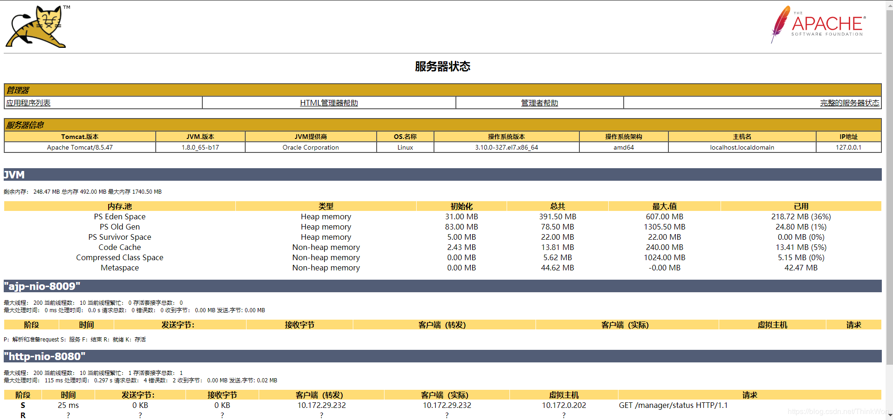
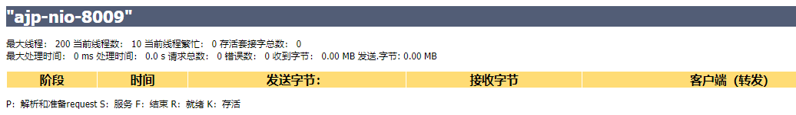
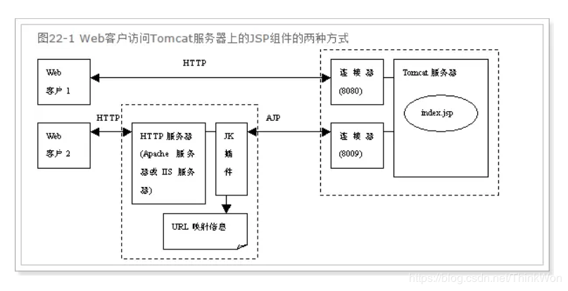
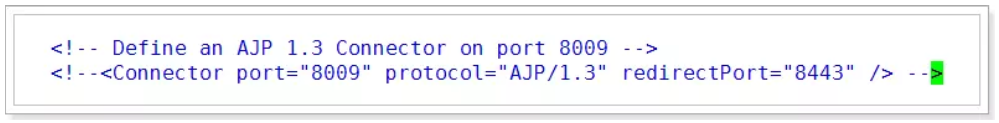
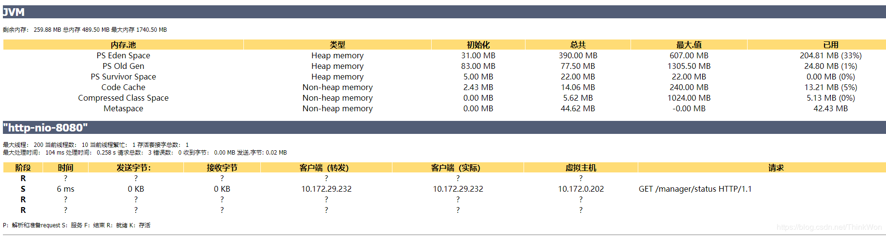
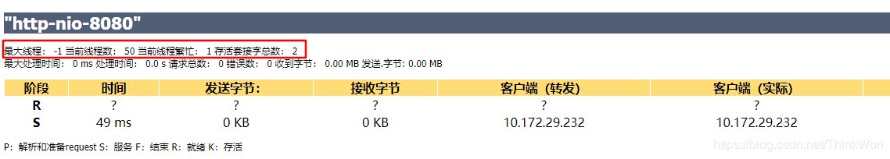
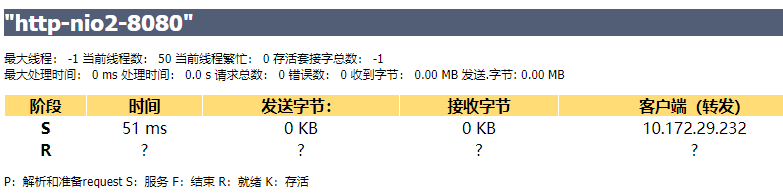

# Tomcat优化
- [Tomcat优化](#tomcat优化)
  - [Tomcat配置优化](#tomcat配置优化)
    - [配置修改](#配置修改)
    - [启动Tomcat](#启动tomcat)
  - [Tomcat优化](#tomcat优化-1)
    - [禁用AJP连接](#禁用ajp连接)
      - [什么是AJP](#什么是ajp)
    - [执行器（线程池）](#执行器线程池)
    - [tomcat的三种运行模式](#tomcat的三种运行模式)
      - [tomcat设置nio2](#tomcat设置nio2)
      - [SpringBoot内嵌tomcat设置nio2](#springboot内嵌tomcat设置nio2)
      - [APR安装](#apr安装)
      - [tomcat设置APR](#tomcat设置apr)
      - [SpringBoot内嵌tomcat设置nio2](#springboot内嵌tomcat设置nio2-1)

## Tomcat配置优化
> Tomcat版本为8.0+

### 配置修改
```
# 进入tomcat配置文件夹
cd apache-tomcat-8.5.47/conf/
# 需要配置文件，配置tomcat的管理用户
vim tomcat-users.xml
# <tomcat-users>标签里面添加如下内容写入以下内容：

  <role rolename="manager"/>
  <role rolename="manager-gui"/>
  <role rolename="admin"/>
  <role rolename="admin-gui"/>
  <user username="tomcat" password="tomcat" roles="admin-gui,admin,manager-gui,manager"/>
# 保存退出
# 如果是tomcat7，配置了tomcat用户就可以登录系统了，但是tomcat8中不行
# 还需要修改下面一个配置文件，否则访问不了，提示403
vim  cd webapps/manager/META-INF/context.xml

<Context antiResourceLocking="false" privileged="true" >
<!--  <Valve className="org.apache.catalina.valves.RemoteAddrValve"
         allow="127\.\d+\.\d+\.\d+|::1|0:0:0:0:0:0:0:1" />  -->
  <Manager sessionAttributeValueClassNameFilter="java\.lang\.(?:Boolean|Integer|Long|Number|String)|org\.apache\.catalina\.filters\.CsrfPreventionFilter\$LruCache(?:\$1)?|java\.util\.(?:Linked)?HashMap"/>
</Context>

# 保存退出即可
# 启动tomcat
```
### 启动Tomcat
成功访问tomcat地址后，点击 首页中 ServerStatus，输入用户名密码 tomcat/tomcat。  
进入页面，主要包括服务器信息，JVM，ajp和http信息。   


我们需要关注的就是其中JVM的列表参数：  
**Eden Space**：年轻代中的Eden区  
**Survivor Space**：年轻代中的Survivor 区  
**Tenured Gen**：老年代-养老区  
其中 `EdenSpace`、`SurvivorSpace`、`TenuredGen`属于堆内存，而下面的三个（ `CodeCache`、`CompressedClassSpace`、`Metaspace`）属于非堆内存  
**Code Cache**：代码缓存区  
**Compressed Class Space**：压缩类空间  
**Metaspace**：元空间

## Tomcat优化

### 禁用AJP连接
在服务状态页面中可以看到，默认状态下会启用AJP服务，并且占用`8009`端口。  

#### 什么是AJP
AJP（Apache JServer Protocol）  
AJPv13协议是面向包的。WEB服务器和Servlet容器通过TCP连接来交互；为了节省SOCKET创建的昂贵代价，WEB服务器会尝试维护一个永久TCP连接到servlet容器，并且在多个请求和响应周期过程会重用连接。

我们一般是使用Nginx+Tomcat的架构，所以用不着AJP协议，把AJP连接器禁用。  
修改conf下的server.xml文件，将AJP服务禁用掉即可。
```
<!-- 禁用AJP连接 -->
<!-- <Connector port="8009" protocol="AJP/1.3" redirectPort="8443" /> -->
```

重启Tomcat，可以看到AJP服务已经不存在了。

### 执行器（线程池）
在tomcat中每一个用户请求都是一个线程，所以可以使用线程池提高性能。  
修改server.xml文件：
```
<!--将注释打开-->
<Executor name="tomcatThreadPool" namePrefix="catalina-exec-"
    maxThreads="500" minSpareThreads="50" 
    prestartminSpareThreads="true" maxQueueSize="100"/>
    
 <!--
  参数说明：
  maxThreads：最大并发数，默认设置 200 ，一般建议在 500-1000，根据硬件设施和业务来判断
  minSpareThreads：Tomcat 初始化时创建的线程数，默认设置 25
  prestartminSpareThreads：在Tomcat初始化的时候就初始化 minSpareThreads 的参数值，
  如果不等于true ,minSpareThreads 的值就没啥效果了
  maxQueueSize：最大的等待队列数，超过则拒绝请求
-->

   <!-- 在Connector中设置 executor 属性指向上面的执行器 -->
<Connector executor="tomcatThreadPool" port="8000" 
       protocol="HTTP/1.1" connectionTimeout="20000"
       redirectPort="8443" />
```
保存退出，重启tomcat，查看效果。
  
在页面中显示最大线程数为-1，这个是正常的，仅仅是显示的问题，实际使用的是指定的值。如果配置了一个Executor，则该属性的任何值将被正确记录，但是它将被显示为-1。

### tomcat的三种运行模式
tomcat的运行模式有3种：

**bio**
性能非常低下，没有经过任何优化处理和支持

**nio**
nio(new I/O)，是Java SE 1.4及后续版本提供的一种新的I/O操作方式(即java.nio包及其子包)。Java nio是一个基于缓冲区、并能提供非阻塞I/O操作的Java API，因此nio也被看成是non-blocking I/O的缩写。它拥有比传统I/O操作(bio)更好的并发运行性能。**Tomcat8默认使用nio运行模式。**

**apr**
安装起来最困难，但是从操作系统级别来解决异步的IO问题，大幅度的提高性能。APR(Apache Portable Runtime)的整体模式还是非阻塞IO，实现的线程模型也是按照NIO的标准模型实现的，从[官方文档](http://apr.apache.org/docs/apr/1.6/modules.html)可以看到APR根据不同操作系统，分别用c重写了大部分IO和系统线程操作模块，这就是为什么APR在不改动代码的情况下能够提升。以下为APR重写的模块：
>Memory allocation andmemorypool functionality  
Atomic operations  
Dynamic library handling  
File I/O  
Command-argument parsing  
Locking  
Hash tables andarrays  
Mmap functionalityNetwork sockets andprotocols  
Thread, process andmutex functionality  
Shared memory   
Time routinesUser andgroup ID services

对于每种协议，Tomcat都提供了对应的I/O方式的实现，而且Tomcat官方还提供了在每种协议下每种I/O实现方案的差异， HTTP协议下的处理方式如下表，详情可查看[Tomcat官网说明](https://tomcat.apache.org/tomcat-8.5-doc/config/http.html) 

|        | **BIO**        | **NIO**           | **NIO2**           | **APR**           |
|--------|----------------|-------------------|--------------------|-------------------|
| 类名     | Http11Protocol | Http11NioProtocol | Http11Nio2Protocol | Http11AprProtocol |
| 引用版本   | ≥3\.0          | ≥6\.0             | ≥8\.0              | ≥5\.5             |
| 轮询支持   | 否              | 是                 | 是                  | 是                 |
| 轮询队列大小 | N/A            | maxConnections    | maxConnections     | maxConnections    |
| 读请求头   | 阻塞             | 非阻塞               | 非阻塞                | 阻塞                |
| 读请求体   | 阻塞             | 阻塞                | 阻塞                 | 阻塞                |
| 写响应    | 阻塞             | 阻塞                | 阻塞                 | 阻塞                |
| 等待新请求  | 阻塞             | 非阻塞               | 非阻塞                | 非阻塞               |
| SSL支持  | Java SSL       | Java SSL          | Java SSL           | Open SSL          |
| SSL握手  | 阻塞             | 非阻塞               | 非阻塞                | 阻塞                |
| 最大链接数  | maxConnections | maxConnections    | maxConnections     | maxConnections    |

推荐使用nio，在tomcat8中有最新的nio2，速度更快，建议使用nio2。
#### tomcat设置nio2
```
<Connector executor="tomcatThreadPool" port="8000" protocol="org.apache.coyote.http11.Http11Nio2Protocol"
     connectionTimeout="20000"
     redirectPort="8443" />
```

#### SpringBoot内嵌tomcat设置nio2
```
@Configuration
public class APRConfig {
    @Value("${tomcat.apr:false}")
    private boolean enabled;
    // https://docs.spring.io/spring-boot/docs/1.5.6.RELEASE/reference/htmlsingle/#howto-discover-build-in-options-for-external-properties
    @Bean
    public EmbeddedServletContainerFactory servletContainer() {
        TomcatEmbeddedServletContainerFactory container = new TomcatEmbeddedServletContainerFactory();
        if (enabled) {
            LifecycleListener arpLifecycle = new AprLifecycleListener();
            container.setProtocol("org.apache.coyote.http11.Http11Nio2Protocol");
            container.addContextLifecycleListeners(arpLifecycle);
        }

        return container;
    }
}
```
#### APR安装
1. `rpm -q | grep apr`来查看是否安装了apr，如果安装了则不再需要安装
2. 下载openssl，需要版本大于1.0.2，如果不适用https的话不需要安装，只是启动会报错，忽略即可
3. 下载APR组件依赖[地址](http://apr.apache.org/download.cgi)
4. 安装相关环境包
   `# yum -y install cmake gcc expat-devel`
5. 安装APR
   ```
    # cd /data/bao/apr-1.6.5/
    # ./configure --prefix=/usr/local/apr
    # make
    # make install
   ```
6. 安装apr-iconv
   ```
    # cd /data/bao/apr-iconv-1.2.2/
    # ./configure --prefix=/usr/local/apr-iconv --with-apr=/usr/local/apr --with-java-home=/usr/lib/jvm/jdk-8u144-linux-x64/jdk1.8.0_144
    # 安装apr-util需要配置apr路径和jvm路径，否则会报错找不到apr
    # make && make install
   ```
7. 安装apr-util
   ```
    # cd /data/bao/apr-util-1.6.1/
    # ./configure --prefix=/usr/local/apr-util --with-apr=/usr/local/apr --with-apr-iconv=/usr/local/apr-iconv/bin/apriconv --with-java-home=/usr/lib/jvm/jdk-8u144-linux-x64/jdk1.8.0_144
    # 安装apr-util需要配置apr路径和jvm路径，否则会报错找不到apr
    # make && make install
   ```
8. 安装Tomcat-native
   ```
    # cd tomcat_home/bin
    # tar -zxvf tomcat-native.tar.gz
    # cd tomcat-native-1.2.17-src/native/
    # ./configure --with-apr=/usr/local/apr --with-java-home=/usr/lib/jvm/jdk-8u144-linux-x64/jdk1.8.0_144
    # 安装apr-util需要配置apr路径和jvm路径，否则会报错找不到apr
    # make && make install
   ```
9. 修改环境变量
   ```
    # vim /etc/profile
    export LD_LIBRARY_PATH=/usr/local/apr/lib ##添加apr path
    # source /etc/profile
   ```
#### tomcat设置APR
1. 修改protocol值
   Tomcat默认是HTTP/1.1，如果运行apr模式需要把protocol值修改成apr模式：org.apache.coyote.http11.Http11AprProtocol
   ```
   # vi server.xml
    <Connector port="8080" protocol="org.apache.coyote.http11.Http11AprProtocol"
   ```
2. 修改SSLEngine
   ```
    # vi server.xml
    <Listener className="org.apache.catalina.core.AprLifecycleListener" SSLEngine="off" />
   ```
3. 启动tomcat验证
   
#### SpringBoot内嵌tomcat设置nio2
1. 增加一个apr配置类在启动的时候修改Embed的tomcat connector网络接入协议。
   ```
    @Configuration
    public class APRConfig {
        @Value("${tomcat.apr:false}")
        private boolean enabled;
        // https://docs.spring.io/spring-boot/docs/1.5.6.RELEASE/reference/htmlsingle/#howto-discover-build-in-options-for-external-properties
        @Bean
        public EmbeddedServletContainerFactory servletContainer() {
            TomcatEmbeddedServletContainerFactory container = new TomcatEmbeddedServletContainerFactory();
            if (enabled) {
                LifecycleListener arpLifecycle = new AprLifecycleListener();
                container.setProtocol("org.apache.coyote.http11.Http11AprProtocol");
                container.addContextLifecycleListeners(arpLifecycle);
            }

            return container;
        }
    }
    ```
2. 在启动参数中加上apr路径  
    `-Djava.library.path=/usr/apr/lib`
3. 启动验证
    `2020-07-24 15:31:19,051 - Starting ProtocolHandler ["http-apr-8081"]`